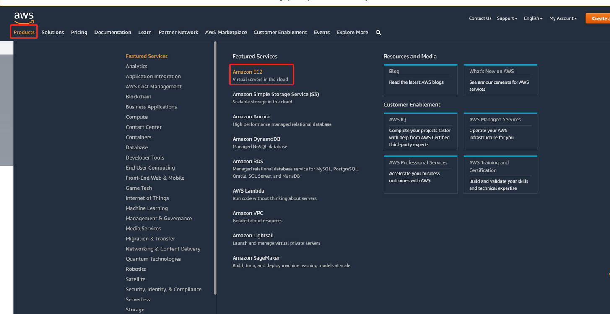
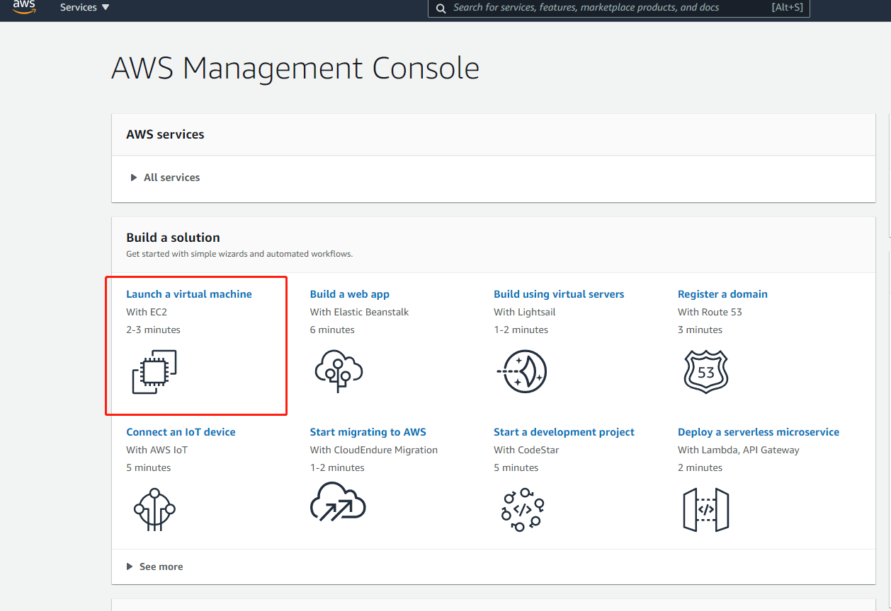
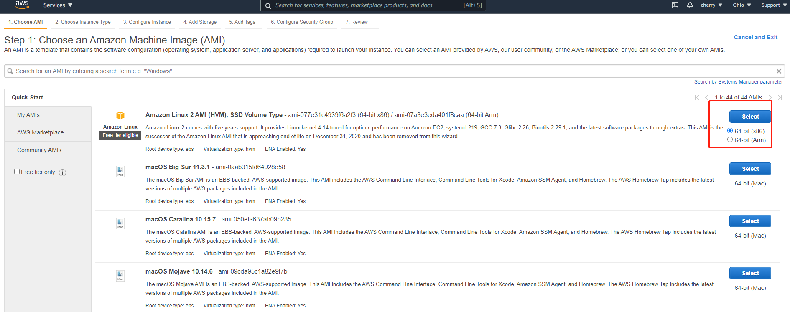
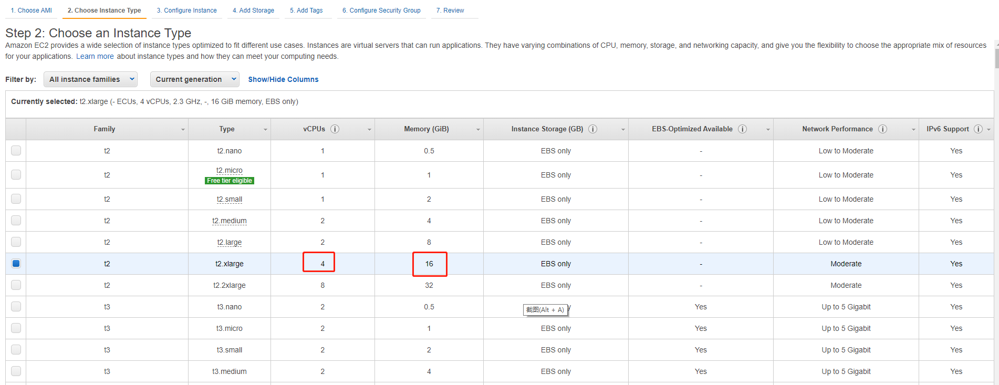
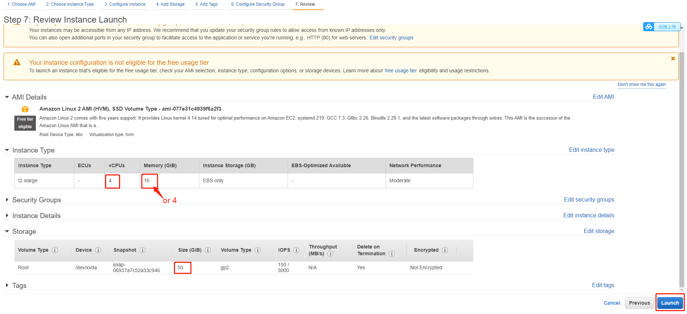

### Linux FAQ
*  1. How to buy a cloud server?
Take Amazon Cloud as an example below.
1.Register an [Amazon Cloud](https://us-east-2.console.aws.amazon.com/ec2/v2/home?region=us-east-2#Home:) account.
2.After registration, click on the product and select "EC2".

 

3.Enter the page and click to buy directly. Enter the server configuration page.

 

You can purchase it as shown in the configuration page. This configuration is based on the hardware requirements of the mainnet. The page memory can be 4G.

 

The internal network bandwidth is not limited, the external network bandwidth is selected according to your needs.


 

Select Finish and click "Launch" to complete the payment and successfully purchase a server.
Check the server you purchased, click the console in the upper right corner, select the instance, you can see the server you purchased in the instance.



*  Why does running the decompressed file prompt a version error?
This problem is that there is a low version of the mainnet program in the network. Check whether the version installed by yourself is the latest version.
 
### Node FAQ
* Block height is not synchronized
* Block stuck at a certain height
* Forgot node password

### Phone connection problem
* Transaction signature failed
Transaction signature failure is due to the following reasons:
1. The transaction is not issued.
2. There are too few pledge nodes in the network nodes, and no mining fees are set.
3. The same account cannot be connected to make transactions.
* Can't find node
The node cannot be searched usually because the mobile phone wifi and the node wifi are not in the same network segment.
* Failed to unpledge
When unpledged, it is required that the assets can be unpledged after 30 days.

### other problems
* The transaction was unsuccessful.
Possible Causes:
1. Determine whether the node is connected to the server.
   Can you ping the public network server? Whether ports 11187, 11188, and 11190 are open.
2. See if the balance is enough, that is, if the handling fee + transaction fee is less than the balance.
  Run the program.

 ```powershell 
   ./uenc_xxx_testnet -m   
 ``` 

   After running, the following message will appear:

```powershell
Version: 1_xxx_t
Base58: 15md8eripkG9n4hGMNacEar7AqTfudvWBZ
Balance: 0
Mac md5: 887da3c400cd1fcaf2d5431abcbc647d
Signature Fee: 1100
Package Fee: 0
Block top: 1919
Top block hash: d955017db4475742caeb9b9d143c7d9b79126b9c4e5cee1b55f735b00f42fdbd
```  

  Balance is your balance. Your transaction fee + mining fee X (consensus number -1) is your total cost of this transaction. See if the balance is greater than the total cost.

3. Whether to set a mining fee
Signature is the mining fee. To see if the mining fee is set, set the mining fee:
```powershell
  ./uenc_xxx_testnet -s  0.015
```  

4. Is the block height of this node the same as the block height of the entire [network node](http://www.uenc.io/chainExplorer/index.html#/)?
Block tops is the height of the block, and check whether the height is the same through the browser.

<font color='#5432F4'>Q&A:
Failed to connect to the node on the mobile phone: The Wi-Fi on the mobile phone must be in the same local area network as the network of the connected node.
Mobile terminal transaction failure: When the mobile terminal is set to too low a mining fee, it is easy to fail, and if the consensus number is set too much, it is easy to fail.
Mobile Pledge: The minimum pledge on the mobile terminal is 500UENC, and the pledge of the pledged asset can be released after 30 days.
Cannot initiate a transaction: Whether the current node account is in the suspended list, and whether the current node's height is within 5 heights of the mainnet's height.
</font>

