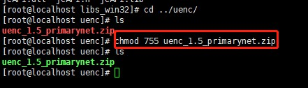
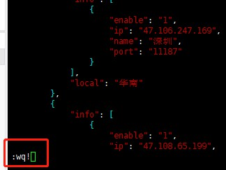

This chapter introduces the addition of a UENC running node on CentOS 7. You can become a member of the UENC family by adding the installation procedure of the node.
Transactions and mining can be carried out on the node machines. Mining involves using local nodes to sign the transaction and obtain mining fees.

### Ready to work

#### Understand the Linux system

##### 一、Connecting the Linux system

Download and install xshell. Click New and follow the steps shown below to link to the server.
Enter the name of the server alias that you can choose. The host enters the IP address for the server, while the port for remote connection is 22 by default.


After configuration, click "User Authentication" and enter the user name. Generally, the default is "root", and the password is the one set when the system is installed.


xshell link server: connect to the server, enter the password, and check "Remember Password".


Click OK or connect to enter the server.

##### 二、 The basic commands of Linux
Here we introduce some basic Linux commands commonly used in this program. For other Linux commands, please refer to:


 * #ls                                     -- View the current file directory
 * #chmod 755 File name      -- Give the file readable and executable permissions to the current user
 * #cd /directory         -- to the corresponding root directory
 * #vim config.json       --Enter the file for editing, press the i key to edit and modify, and press the Esc key when you are finished. Enter: wq! Enter to exit
 * Flexible use of the Tab key.  When the console inputs a file or directory, you can use the tab key to complete the file directory.
 * Use the up and down keys flexibly.  When you want to re-enter a command you have previously entered, you can press the up key to search, eliminating the need to re-enter.


#### Deployment environment preparation

##### Hardware requirements:
The UENC program needs to allocate a little memory when running.
* CPU: Four cores (Minimum one cores)
* Memory: 4G
* Disk: at least 50G

##### Operating system:
* CentOS 7 (a free, open source, and redistributable open source operating system) and CentOS (Community Enterprise Operating System) is one of the Linux distributions.
* Purchase a cloud server or physical server.

#### Code preparation
<font color='5432F4' > tips:Be familiar with the next operation. Learn the basic commands of the Linux system console.</font>
 * You can [download](https://github.com/uenctech/uenc-demo/tree/master/uenc) binary programs for CentOS 7 directly from GitHub. GitHub is a hosting platform for open source and private software projects, so named because it supports Git as the only repository format for hosting.  
 You can also download through the following methods:
 
Download the mainnet program (UENC_xxx_primarynet.zip)
 ```
 git clone https://github.com/uenctech/uenc-demo.git 
 ```
Found in the director uenc_xxx_primarynet.zip Unzip and install.


 Download the testnet program (UENC_xxx_testnet.zip)


 ```
 git clone https://github.com/uenctech/uenc-demo.git 
 ```
Found in the director uenc_xxx_primarynet.zip Unzip and install.
 


 After downloading, modify the execution permission of the downloaded installation file and decompress it.  
Modify execution permissions
 ```
 chmod 755 uenc_1.3_testnet.zip
 ```
 

<!--  -->
As can be seen in the above picture, the compressed file .zip has changed from <font color='#ff5555' >red</font> to <font color='5432F4' >green</font>. This is also a sign of whether authorization has ben granted successfully.

Unzip
 ```
 unzip uenc_1.3_testnet.zip
 ```
    
 
### About file structures
Check the file structure after decompression is complete

 ```
 ls
 ```

 
 
Or xftp view

 

 | File or directory |     Description     | 
 | :--------: | :--------------: | 
 |   .md   | Documents ending with this extension are provided for users to read, including development documents. | 
 |   .assets   | The logical structure diagram of the mainnet of UENC. Users can read them if interested. | 
 |   uenc   | Directory file for storing the mainnet program. | 
 |   libs_linux   | A static library file provided for developers to connect to the mainnet Linux system. | 
 |   libs_win32   | A static library file provided for developers to connect to the mainnet Windows system. | 


### Node configuration
Enter the UENC directory #cd uenc_1.5_xxx
 * Run the obtained installation file
<font color='5432F4' >tips:Check whether the file is given readable and executable permissions before running.</font>
 ```
 ./uenc_1.3_testnet
 ```
 * After execution, press Ctrl + C to exit the current program. At this time, the following files and directories will be generated in the current directory.
 
 | File or directory |     Description     | 
 | :--------: | :--------------: | 
 |   cert   | Stores the generated public-private key pair. The file with the extension ".public.key" is the public key file, while the file with the extension ".private.key" is the private key file. | 
 |   data.db   | Database file. | 
 |   devpwd.json   | The local access password hash value. When the mobile terminal connects, use the password to connect. | 
 |   config.json   | Configuration file. | 
 |   log.txt   | Log file. | 


 #### Modifying the configuration document

Modify the configuration file config.json. For a subnet node without configuration, you can run it directly according to the default configuration.
  
 ```
vim config.json

 ```

After editing, exit. Re-execute the ./UENC_1.xx_xxx command to take effect.

If you are a public network node, modify it as follows:
 1. The value of is_public_node needs to be changed from false to true.
 2. Set the value of the IP field in the server to the IP address of other public network nodes connected to your own node.
 3. Set the local_ip field under the var field to the external network IP address of its own node.
 
For example, if the external IP address of its own node is xxx.xxx.xxx.xxx, and the connected public network address is yyy.yyy.yyy.yyy, then configure as follows (take the test network public network node configuration as an example).
 ```
	  "is_public_node": true,
    "server": [
        {
            "IP": "yyy.yyy.yyy.yyy",
            "PORT": 11188
        },
    ],
    "var": {
    "k_bucket": "a0dbbd80eb84b9e51f3a0d69727384c651f9bdb5",
    "k_refresh_time": 100,
    "local_ip": "xxx.xxx.xxx.xxx",
    "local_port": 11188,
    "work_thread_num": 4
    },

 ```
 
 

