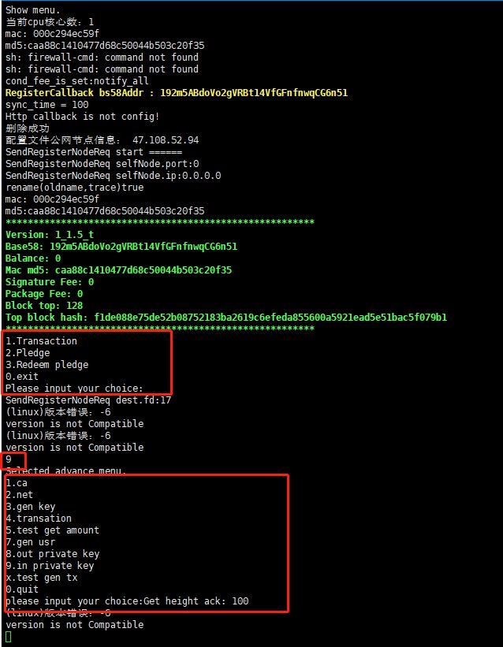

 ###  About parameters:  
The installation file can be followed by parameters when it is running. The parameters are described as follows.


| Parameter |Description|
|:-------:|:---------:|
|--help |Get the help menu. |
|-m       |Show menu.   |
|-s       |Set mining fee.  |
|-p       |Set packing fee. |  


 ### About the menu：

Test node command:
```
 ./uenc_xxx_testnet -m 
```

Public network node command:

```
 ./uenc_xxx_primarynet -m 
```

After the program starts, you can see the following menu:

```
	1.Transaction  
	2.Pledge  
	3.Redeem pledge  
	0.exit  
	Please input your choice: 

```

As shown below:

 

### Generating an account
After executing ./UENC_xxx_testnet, the above messages appear. Among them, RegisterCallback bs58Addr:xxxxxxxx is the wallet address generated by this node. Please keep this wallet address in a safe place. Revenue from mining is stored at this wallet address.

### Set a packing fee

Such as setting a mining fee:
Test node command:
```
    ./uenc_1.3_testnet -s  0.015
```

Public network node command:
```
    ./uenc_1.3_primarynet -s  0.015
```

 Note: Actual value = value * 0.000001. Minimum actual value: 0.000001.

### Set a signing fee

After the program starts, press the number 9 to enter the following menu, 

```
1.ca
2.net
3.gen key
4.transation
5.test get amount
7.gen usr
8.out private key
9.in private key
x.test gen tx
0.quit
Please input your choice: 

```

and then press 8.out private key to print the private key and recovery phrase of the default account.

 

Then press 1.ca to enter the ca menu, and then press 9 to the following menu.

```
1. Generate recovery phrases.
2. Simulate staked assets.
3. Get the fuel cost set by this machine and the maximum and minimum average fuel cost of the entire network node.
4. Check the balance based on UTXO.
5. Set node signing fee.
8. Simulated solution of pledged assets.
9. Query the amount of pledged assets of an account.
10. Multi-account transactions.
11. Query transaction list.
12. Query transaction details.
13. Query block list.
14. Query block details.
15. Query all staking addresses.
16. Get the total number of blocks in five minutes.
17. Set node packaging fees.
18. Get all public network node packaging fees.
19. Automatic out-of-order transaction (simplified version).
20. Test to get the first 100 rewards for each account.
21. Obtain block information through a transaction hash.
22. Get a list of failed transactions.
23. Determine whether the height of the node meets the height range.

```
Then press 5 to enter the node signature fee settings.

 

### Export && save a private key

After the program starts, press the number 8 to export the private key, and 9 to enter the following menu.
After the program starts, press the number 9 to enter the following menu, and then press 8.out private key to print the private key and recovery phrase of the default account.
```
1.ca
2.net
3.gen key
4.transation
5.test get amount
7.gen usr
8.out private key
9.in private key
x.test gen tx
0.quit
```


### Make a transfer

1. Note that the mining fee needs to be set before initiating a transaction and the value of the mining fee is between 0.001 and 0.1. 
 Enter 1 and press Enter to enter your account address.
 ```
      input FromAddr :
      12GwpCQi7bWr8cbmU2r1aFia1rUQJDVXdo
 ```
Enter your account address and press Enter. This will let you enter the other party's account address.
 ```
     input ToAddr：
     1vkS46QffeM4sDMBBjuJBiVkMQKY7Z8Tu   
 ```
 After entering the account address of the other party, press Enter and the system will prompt you to enter the transaction amount.
 ```
    input amount :
    999999 
 ```
After entering the transaction amount, press Enter and the system will prompt you to enter the number of signatures. The minimum number of signatures is 6 and the maximum is 15.
 ```
    input needVerifyPreHashCount :  
    6 
 ```
After you enter the number of signatures, press Enter and the system will prompt you to enter the handling fee. Note that the handling fee range is also between 0.001 and 0.1.
 ```
    input minerFees : 
          0.012
         
 ```
After input, the transaction is initiated by pressing Enter.


### Staking
<font color='#5432F4' >Before testing the network staking, you need to apply for a quantitative amount from the faucet account to perform staking and de-staking operations</font>

2.Pledge means staking.
After the initial menu appears, enter 2 and press Enter. Note that the staked account is your own local account, and the system prompts you to enter the stake deposit amount.
```
 Please input amount：
        325555     
```
After entering the amount, press Enter and the system will prompt you to enter the mining fee.
```
    Please input GasFee:
    0.014
```   
After entering, press Enter and the system will prompt you to enter the password.
```
     password:
     158660
```
After entering the password, press Enter and the staking is completed.

### De-staking
  3. Redeeming a pledge means de-staking.  
Enter 3 and press Enter and you will be prompted to enter the account number to be staked.
```
     Selected redeem pledge.
addr：
     12GwpCQi7bWr8cbmU2r1aFia1rUQJDVXdo
```
After entering, press Enter and the system lists all utxo of the current account
```
     -- There is already a pledge  --
utxo: e77074aa69a97ea6f018bc4ef5d4fa643e823c46ab6c59958c0e5d288befbe8d
```
Enter the utxo you want to de-stake (copy and paste) and press Enter to finish de-staking.

### Mining
If a node wants to carry out mining in the background, it must first stake itself. If it does not stake, the signature node will be removed when the transaction is initiated. It also has a node signature fee and then starts the daemon.
```
./ebpc_daemon 
./ebpc_xxx_testnet 
./ebpc_xxx_testnet 

```
After starting the daemon, you cannot configure config or start the program again, unless you kill the daemon and restart the program.