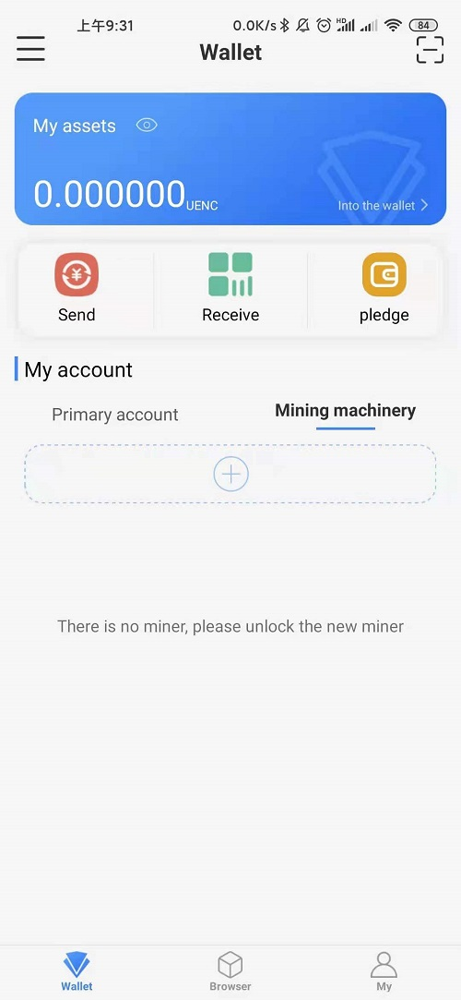
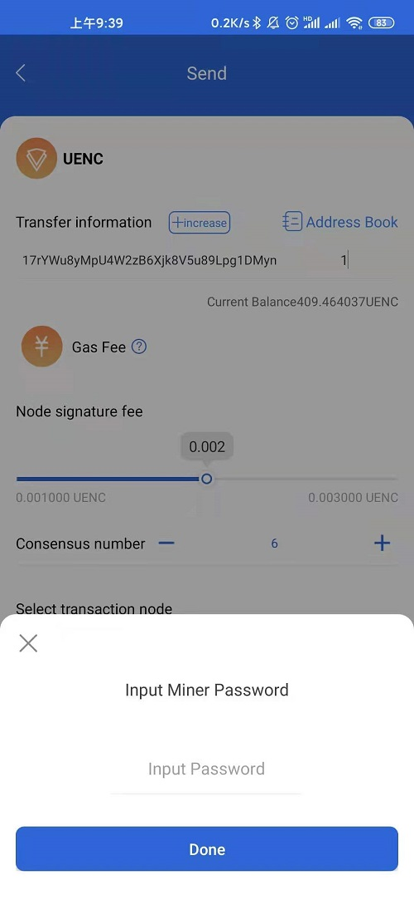

### 1.Need to download the app first
   * When you open the [official website](https://www.uenc.io/#/index), there is a button with M at the bottom. Place the mouse on the button on the right and two QR codes will pop up. One is Energy Club and the other is Fastoken. Scan the QR code Fostoken to install the app.
   
   

   After the app is successfully installed   
   
### 2.Create a digital identity  
 * After the installation is successful, open the app to enter the welcome page.  
   
 *  Click the Agree button on the welcome page to enter the digital identity creation page. On this page, the phone will ask whether the storage permission is allowed for "Fastoken". Click the always allow button below. Click on the Chinese-English switch button at the top right.
The three pop-up buttons are Simplified Chinese, English, and Cancel.

 
  
   Click the Simplified Chinese button to start creating a digital identity. 

   

     Enter the identity name (maximum length 14) and password and repeat the password as required. Click the Create button to enter the backup recovery phrase page.  
### 3.Backup recovery phrase phrase  
 *  Click Create in the previous step to enter the page that prompts you to back up the recovery phrase phrase.  

 
 * After reading the content of the page carefully, click Next (or backup later) to pop up the recovery phrase page for you to backup.

 
 
 * After backing up the recovery phrase words, click Next. You are then required to click on the recovery phrase words that appear in order. 

  
 
 After the operation, click the Finish button to return to the home page. 
### 4. Connect nodes
 * After the recovery phrase phrase is successfully backed up, it will return to the homepage and the current display is the main account (highlighted).  

 
 
 * At this time, the node is not connected yet, click on the node to switch to the node account.

 
   
  Click + under the node to enter the node search list.

  
  
 *  Select a node in the node list to connect (Note: the mobile phone must be connected to wi-fi, and the mobile phone wi-fi and the connected node are in the same local area network).
Select a node, click Connect node, and the input password box will pop up. The default password of the node is 12345678, enter the password.  

 
* Click the Finish button if the connection is successful, the following page will pop up.

 Click Set Now on the above page to enter the fuel fee setting page.
### 5.Set the fuel fee  
* After the node is successfully connected, click Set Now to enter the setting fuel fee interface, and you can set and modify the current node fuel fee. 

* After reading the above content, enter the fuel fee and click Save to return to the node list interface.
### 6.The main account initiates the transfer
* Go back to the homepage and switch to the main account. 

 
   Click the transfer button to enter the transfer page.  

   
 
 Enter the transaction amount of the transfer address and drag the small circle of the signature fee to set the signature fee, and click-or + of the consensus number to set the consensus number. Click the arrow at the bottom right of the selected transaction node to enter the node setting page. 

 
 
 Click the node you want to select to return to the transfer interface, click the transfer button to enter the transfer confirmation interface, and click confirm. The transfer system prompts that the transaction is successfully initiated.

### 7.Node account initiates transfer   
* Enter the homepage and click on the node to switch to the node account.

 
*  Click the transfer button on the node account to enter the transfer page.

Enter the transaction amount of the wallet address. Drag the small circle under the single-node signature fee to set the signature fee, and click-or + to the right of the consensus number to set the signature fee. The node that initiates the transfer transaction does not need to select the node.
  Click the transfer button to pop up the input node password interface.

  
 
 After entering the password, click Finish to pop up the transfer confirmation page.

 
  
  After reading the information on the interface, click the Confirm Transfer button and the system prompts that the submission is successful.

  

### 8.Check transaction status 
*  On the homepage, click the small arrow on the right side of the wallet to enter the wallet. 

 
 Wallet page 

 
 
On this page, you can check whether your transaction has failed, succeeded, or is in progress.
### 9.Log out of the main account   
* If there are multiple primary accounts, the primary account in use cannot be logged out.
P
 Click the settings button to enter the settings page.

 If there is no backup recovery phrase before exit, the system prompts you to back up the recovery phrase. After backup, click the Exit Current Account button and a password box will pop up. After entering the password, click OK to exit the main menu.
The account returns to the registered digital identity page.
  
### 10.Recover account    
* Two ways: 1 recovery phrase recovery; 2 private key recovery.
  Click the wallet management button on the homepage, enter the wallet management interface and click the create button in the lower right corner.
  Enter the create digital identity page, click the restore identity button at the bottom to enter the restore identity page.
 Choose a recovery phrase or private key to restore your identity.