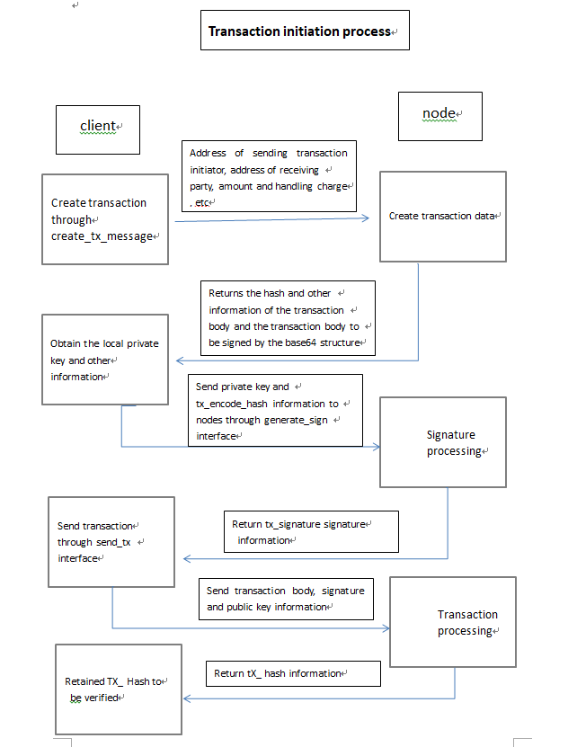

## 一、Set device password interface (SetDevPasswordReq)

1. Request

   ```dict
   message SetDevPasswordReq 
   {
       string version = 1;
       string old_pass = 2;
       string new_pass = 3;
   }
   ```
   
   |   Field   |         Description        |
   | :------: | :------------------: |
   | version  |        Version number       |
   | old_pass |        Old password        |
   | new_pass |        New password        |
   
2. Response

   ```dict
   message SetDevPasswordAck 
   {
       string version = 1;
       sint32 code = 2;
       string description = 3;
   }
   ```

   |    Field     |                             Description                           |
   | :---------: | :----------------------------------------------------------: |
   |   version   |                         版本号                               |
   |    code     | 0 success; -1 parameter error; -2 password cannot be empty; -3 old password is illegal (special characters or longer than 8 bytes); -4 new password is illegal (special characters or longer than 8 bytes);- 5 The old and new passwords cannot be the same; -6 The old password is not verified correctly; -7 Unknown error.|
   | description |  Text description of the return value.  |
3. Code example

```python
# Set device password interface (SetDevPasswordReq)
def SetDevPasswordRequest():
    # Fixed parameters (parameters can be modified)
    HOST = '192.168.1.141'
    PORT = 11187
    VERSION = '1_1.3_p'
    OLD_PASS = 11111111
    NEW_PASS = 12345678

    # Create socket request
    pd = socket.socket(socket.AF_INET, socket.SOCK_STREAM)
    ADDR = (HOST, PORT)
    # Connect to the server
    pd.connect(ADDR)
    # Send data
    addr = protobuf_pb2.SetDevPasswordReq()
    addr.version = VERSION
    addr.old_pass = str(OLD_PASS)
    addr.new_pass = str(NEW_PASS)

    common = protobuf_pb2.CommonMsg()
    common.version = VERSION
    common.type = 'SetDevPasswordReq'
    # Serialization
    common.data = addr.SerializeToString()
    sendData = common.SerializeToString()
    # Get the total length of the agreement
    data_len = len(sendData) + 4 + 4
    data_len_ = ('<i%dsIi' % (data_len - 8))
    end_flag = 7777777
    # Splicing messages
    Splicing_String = struct.pack(data_len_, data_len, sendData, adler32(sendData), end_flag)
    pd.send(Splicing_String)
    target = protobuf_pb2.SetDevPasswordAck()

    while True:
        reply = pd.recv(4)
        time.sleep(0.1)
        #  Receive the first four bytes and parse the data length
        test = int.from_bytes(reply, byteorder='little')
        # Receive data again according to the data length
        reply2 = pd.recv(test)
        # Delete the last 8 bytes of the received data, and the content of the last 8 bytes is the checksum and end_flag
        reply3 = reply2[:(test - 8)]
        # Deserialization reply3
        common.ParseFromString(reply3)
        target.ParseFromString(common.data)
        message_SetDevPasswordAck = protobuf_to_dict(target)
        json_output = json.dumps(message_SetDevPasswordAck, indent=4, ensure_ascii=False)
        #Return json data
        return json_output
```

## 二、Set the miner fee request interface (SetServiceFeeReq)

1.  Request

   ```dict
   message SetServiceFeeReq
   {
   	string version = 1;			
   	string password = 2;					
   	string service_fee = 3;					
   }
   ```

   |     Field     |         Description       |
   | :---------: | :------------------: |
   |   version   |        Version number         |
   |  password   |       Node password       |
   | service_fee |        Set value        |

2.  Response

   ```dict
   message SetServiceFeeAck
   {
   	string version = 1;				
   	sint32 code = 2;					
   	string description = 3;					
   }
   ```

   |    Field    |                   Description                   |
   | :---------: | :---------------------------------------: |
   |   version   |    Version number                 |
   |    code     | 0 success; -6 password error; -7 slide bar value display error |
   | description |  Text description of the return value |
3. Code example

```python
# Set the miner fee request interface (SetServiceFeeReq)
def SetServiceFeeRequest():
    #  Fixed parameters (parameters can be modified)
    HOST = '192.168.1.141'
    PORT = 11187
    VERSION = '1_1.3_p'
    PASSWORD = 12345678
    SERVICE_FEE = 0.01

    # Create socket request
    pd = socket.socket(socket.AF_INET, socket.SOCK_STREAM)
    ADDR = (HOST, PORT)
    # Connect to the server
    pd.connect(ADDR)
    # Send data
    addr = protobuf_pb2.SetServiceFeeReq()
    addr.version = VERSION
    addr.password = str(PASSWORD)
    addr.service_fee = str(SERVICE_FEE)
    data_len_ = len(addr.service_fee)
    sum_ = (58 + data_len_) - 8
    data_len_ = ('<i%dsIi' % sum_)

    common = protobuf_pb2.CommonMsg()
    common.version = VERSION
    common.type = 'SetServiceFeeReq'
    # Serialization
    common.data = addr.SerializeToString()
    sendData = common.SerializeToString()
    #  Get the total length of the agreement
    data_len = len(sendData) + 4 + 4
    end_flag = 7777777

    # Splicing messages
    Splicing_String = struct.pack(data_len_, data_len, sendData, adler32(sendData), end_flag)
    pd.send(Splicing_String)
    target = protobuf_pb2.SetServiceFeeAck()
    while True:
        reply = pd.recv(4)
        time.sleep(0.1)
        # Receive the first four bytes and parse the data length
        test = int.from_bytes(reply, byteorder='little')
        # Receive data again according to the data length
        reply2 = pd.recv(test)
        # Delete the last 8 bytes of the received data, and the content of the last 8 bytes is the checksum and end_flag
        reply3 = reply2[:(test - 8)]
        # Deserialization reply3
        common.ParseFromString(reply3)
        target.ParseFromString(common.data)
        message_SetServiceFeeAck = protobuf_to_dict(target)
        json_output = json.dumps(message_SetServiceFeeAck, indent=4, ensure_ascii=False)
        # Return json data
        return json_output
```

## 四、Get account balance interface (GetAmountReq)

1. Request
   ```dict
   message GetAmountReq 
   {
       string version = 1;
       string address = 2;
   }
   ```

   |  Field   |         Description      |
   | :-----: | :------------------: |
   | version |          Version number       |
   | address |       Wallet password      |

2. Response

   ```dict
   message GetAmountAck 
   {
       string version = 1;
       sint32 code = 2;
       string description = 3;
       string address = 4;
       string balance = 5;
   }
   ```

   |    Field    |              Description               |
   | :---------: | :-----------------------------: |
   |   version   |            Version number            |
   |    code     | Return 0 for success, -1 for unavailable wallet address. |
   | description |        Text description of the return value.         |
   |   address   |            Wallet address.             |
   |   balance   |              Balance.           |
3.  Code example

```python
# Get account balance interface (GetAmountReq)
def GetAmountRequest():
    #  Fixed parameters (parameters can be modified)
    HOST = '192.168.1.141'
    PORT = 11187
    VERSION = '1_1.3_p'
    ADDRESS = '13C4UmhB7tKGdXiJrp2GKsJtmCoJeqGJQz'

    # Create socket request
    pd = socket.socket(socket.AF_INET, socket.SOCK_STREAM)
    ADDR = (HOST, PORT)
    # Connect to the server
    pd.connect(ADDR)
    # Send data
    addr = protobuf_pb2.GetAmountReq()
    addr.version = VERSION
    addr.address = ADDRESS

    common = protobuf_pb2.CommonMsg()
    common.version = VERSION
    common.type = 'GetAmountReq'
    # Serialization
    common.data = addr.SerializeToString()
    sendData = common.SerializeToString()
    #  Get the total length of the agreement
    data_len = len(sendData) + 4 + 4
    data_len_ = ('<i%dsIi' % (data_len - 8))
    end_flag = 7777777  # end flag

    # Splicing messages
    Splicing_String = struct.pack(data_len_, data_len, sendData, adler32(sendData), end_flag)
    pd.send(Splicing_String)
    target = protobuf_pb2.GetAmountAck()
    while True:
        reply = pd.recv(4)
        # Receive the first four bytes and parse the data length
        test = int.from_bytes(reply, byteorder='little')
        # Receive data again according to the data length
        reply2 = pd.recv(test)
        # Delete the last 8 bytes of the received data, and the content of the last 8 bytes is the checksum and end_flag
        reply3 = reply2[:(test - 8)]
        # Deserialization reply3
        common.ParseFromString(reply3)
        target.ParseFromString(common.data)
        # Format data and convert to dictionary format
        message_GetAmountAck = protobuf_to_dict(target)
        json_output = json.dumps(message_GetAmountAck, indent=4, ensure_ascii=False)
        # Return json data
        return json_output
```

## 五、Get the package fee interface of a specific node (GetPacketFeeReq)  deprecated
1. Request

   ```dict
   message GetPacketFeeReq 
   {
   	string version = 1;					
   	string password = 2;					
   	string public_net_ip = 3;						
   }
   ```

   |     Field     |         Description      |
   | :-----------: | :------------------: |
   |    version    |       Version number.        |
   |   password    |       Node password.       |
   | public_net_ip | The IP of the currently connected public network. |

2. Response

   ```dict
   message GetPacketFeeAck 
   {
       string version = 1;
       sint32 code = 2;
       string description = 3;
       string packet_fee = 4;
   }
   ```

   |    Field     |         Description        |
   | :---------: | :------------------: |
   |   version   |           Version number.       |
   |    code     |         0  success       |
   | description |   Text description of the return value.  |
   | packet_fee  |        Packing fee.        |
3. Code example

```python
# Get the package fee interface of a specific node (GetPacketFeeReq)
def GetPacketFeeRequest():
    #  Fixed parameters (parameters can be modified)
    HOST = '192.168.1.141'
    PORT = 11187
    VERSION = '1_1.3_p'
    PASSWORD = 12345678
    PUBLIC_NET_IP = '47.108.52.94'

    # Create socket request
    pd = socket.socket(socket.AF_INET, socket.SOCK_STREAM)
    ADDR = (HOST, PORT)
    # Connect to the server
    pd.connect(ADDR)
    # Send data
    addr = protobuf_pb2.GetPacketFeeReq()
    addr.version = VERSION
    addr.password = str(PASSWORD)
    addr.public_net_ip = PUBLIC_NET_IP

    common = protobuf_pb2.CommonMsg()
    common.version = VERSION
    common.type = 'GetPacketFeeReq'
    # Serialization
    common.data = addr.SerializeToString()
    sendData = common.SerializeToString()
    #  Get the total length of the agreement
    data_len = len(sendData) + 4 + 4
    data_len_ = ('<i%dsIi' % (data_len - 8))
    end_flag = 7777777

    # Splicing messages
    Splicing_String = struct.pack(data_len_, data_len, sendData, adler32(sendData), end_flag)
    pd.send(Splicing_String)
    target = protobuf_pb2.GetPacketFeeAck()
    while True:
        reply = pd.recv(4)
        time.sleep(0.1)
        # Receive the first four bytes and parse the data length
        test = int.from_bytes(reply, byteorder='little')
        # Receive data again according to the data length
        reply2 = pd.recv(test)
        # Delete the last 8 bytes of the received data, and the content of the last 8 bytes is the checksum and end_flag
        reply3 = reply2[:(test - 8)]
        # Deserialization reply3
        common.ParseFromString(reply3)
        target.ParseFromString(common.data)
        message_GetPacketFeeReq = protobuf_to_dict(target)
        json_output = json.dumps(message_GetPacketFeeReq, indent=4, ensure_ascii=False)
        # Return json data
        return json_output
```

##  六、Get the node mining fee interface of the whole network (GetNodeServiceFeeReq)

1. Request

   ```
   message GetNodeServiceFeeReq 
   {
       string version 							= 1;
   }
   ```

   |  Field   |         Description      |
   | :-----: | :------------------: |
   | version | Version number. |

2. Response

   ```
   message GetNodeServiceFeeAck 
   {
       string version 							= 1;
       sint32 code 							= 2;
       string description 						= 3;
   
       repeated ServiceFee service_fee_info 	= 4;
   }
   message ServiceFee
   {
   	string max_fee 		= 1;
   	string min_fee 		= 2;
   	string service_fee 	= 3;
       string avg_fee 		= 4;
   }
   ```

   |       Field      |          Description         |
   | :--------------: | :--------------------: |
   |     version      |  Version number. |
   |       code       |         0 success.         |
   |   description    |    Text description of the return value.    |
   | service_fee_info | Node mining fee information structure array. |
   |     max_fee      |   Maximum transaction value of the first 100 blocks.   |
   |     min_fee      |   The minimum value of the first 100 transactions.  |
   |   service_fee    |     Mining fees set by miners.   |
   |     avg_fee      |   Average of the first 100 transactions.   |


##  七、Get wallet address interface based on password (GetDevPasswordReq)

1. Request

   ```dict
   message GetDevPasswordReq 
   {
       string version = 1;
       string password = 2;
   }
   ```

   |    Field   |         Description           |
   | :------: | :------------------: |
   | version  |        Version number.          |
   | password |         password        |

2. Response

   ```dict
   message GetDevPasswordAck 
   {
       string version = 1;
       sint32 code = 2;
       string description = 3;
       string address = 4;
   }
   ```

   |    Field      |         Description          |
   | :---------: | :------------------: |
   |   version   |       Version number.       |
   |    code     |  Return 0 for success, -2 for unavailable wallet address.|
   | description |   Text description of the return value.  |
   |   address   |       Wallet address.      |

3. Code example

```python
# 、Get wallet address interface based on password (GetDevPasswordReq)）
def GetDevPasswordRequest():
    #  Fixed parameters (parameters can be modified)
    HOST = '192.168.1.141'
    PORT = 11187
    VERSION = '1_1.3_p'
    PASSWODR = 12345678

    # Create socket request
    pd = socket.socket(socket.AF_INET, socket.SOCK_STREAM)
    ADDR = (HOST, PORT)
    # Connect to the server
    pd.connect(ADDR)
    # Send data
    addr = protobuf_pb2.GetDevPasswordReq()
    addr.version = VERSION
    addr.password = str(PASSWODR)

    common = protobuf_pb2.CommonMsg()
    common.version = VERSION
    common.type = 'GetDevPasswordReq'
    # Serialization
    common.data = addr.SerializeToString()
    sendData = common.SerializeToString()
    #  Get the total length of the agreement
    data_len = len(sendData) + 4 + 4
    data_len_ = ('<i%dsIi' % (data_len - 8))
    end_flag = 7777777

    # Splicing messages
    Splicing_String = struct.pack(data_len_, data_len, sendData, adler32(sendData), end_flag)
    pd.send(Splicing_String)
    target = protobuf_pb2.GetDevPasswordAck()
    while True:
        reply = pd.recv(4)
        time.sleep(0.1)
        # Receive the first four bytes and parse the data length
        test = int.from_bytes(reply, byteorder='little')
        # Receive data again according to the data length
        reply2 = pd.recv(test)
        # Delete the last 8 bytes of the received data, and the content of the last 8 bytes is the checksum and end_flag
        reply3 = reply2[:(test - 8)]
        # Deserialization reply3
        common.ParseFromString(reply3)
        target.ParseFromString(common.data)
        message_GetDevPasswordReq = protobuf_to_dict(target)
        json_output = json.dumps(message_GetDevPasswordReq, indent=4, ensure_ascii=False)
        # Return json data
        return json_output
```

##  八、Get client-related information interface from the server (GetClientInfoReq)

1. Request

   ```
   message GetClientInfoReq 
   {
       string version 			= 1;
       DeviceType phone_type 	= 2;
       DeviceLang phone_lang 	= 3;
       string phone_version 	= 4;
   }
   ```

   |     Field      |         Description         |
   | :-----------: | :------------------: |
   |    version    | Version, currently empty. |
   |  phone_type   |      Client type.      |
   |  phone_lang   |       Selected language.       |
   | phone_version |    The version used by the client.   |

2. Response

   ```
   message GetClientInfoAck 
   {
       string version 		= 1;
       sint32 code 		= 2;
       string description 	= 3;
   
       string min_version 	= 4;
       string is_update 	= 5;
       string ver 			= 6;
       string desc 		= 7;
       string dl 			= 8 ;
   }
   enum DeviceType {
       PC 					= 0;
       iOS 				= 1;
       Android 			= 2;
   }
   enum DeviceLang {
       ZH_CN 				= 0;
       EN_US 				= 1;
   }
   ```

   |    Field     |                             Description                             |
   | :---------: | :----------------------------------------------------------: |
   |   version   |                     Version, currently empty.                   |
   |    code     | -1, parameter error; -2, error in obtaining client information, in this case it is necessary to update but obtaining client download information is failed; 0 operation is successful, but no update is required, isUpdate is 0, no client download information; 1 operation Success, including all field information. |
   | description | Text description of the return value.                      |
   | min_version |  The minimum client version supported by the server program.              |
   |  is_update  | Whether to upgrade, 1 means need to upgrade, 0 means no need to upgrade.             |
   |     ver     |                     The version of the client to download.                   |
   |    desc     |                   Descriptive information of the client to be downloaded.                 |
   |     dl      |                     The URL of the client to be downloaded.                     |
   |     PC      |                            PC.                            |
   |     iOS     |                           iOS.                       |
   |   Android   |                         Android.                          |
   |    ZH_CN    |                            Chinese.                           |
   |    EN_US    |                             English.                            |


##  九. Get public network node information interface (GetNodeInfoReq)

1. Request

   ```
   message GetNodeInfoReq 
   {
       string version = 1;
   }
   ```

   |  Field    | Description |
   | :-----: | :--: |
   | version | Version |

2. Response

   ```
   message GetNodeInfoAck 
   {
       string version 					= 1;
       sint32 code 					= 2;
       string description 				= 3;
   
       repeated NodeList node_list 	= 4;
   }
   message NodeList 
   {
       repeated NodeInfos node_info 	= 1;
       string local 					= 2;
   }
   message NodeInfos 
   {
       string enable 					= 1;
       string ip 						= 2;
       string name 					= 3;
       string port 					= 4;
       string price 					= 5;
   }
   ```

   |    Field    |         Description         |
   | :---------: | :------------------: |
   |   version   | Version, currently empty. |
   |    code     |  0 succeeded; -1 failed to obtain.   |
   | description |   Text description of the return value.   |
   |  node_list  |  Node information structure array. |
   |  node_info  |    Node information structure.   |
   |    local    |         Area.        |
   |   enable    |     Whether the node is available.    |
   |     ip      |        Node IP.       |
   |    name     |       Node name.       |
   |    port     |       Node port.       |
   |    price    |         Abandoned.         |


##  十、Get information interface such as average handling fee and synchronization status (GetServiceInfoReq)

1. Request

   ```dict
   message GetServiceInfoReq
   {
       string version = 1;
       string password = 2;	
       string public_net_ip = 3;
       bool is_show = 4;
       uint32 sequence_number = 5;                       
   }
   ```

   |     Field      |                         Description                          |
   | :-----------: | :---------------------------------------------------: |
   |    version    |                 Version                               |
   |   password    |               Mobile phone password (no need to pass temporarily).               |
   | public_net_ip |                      Public network node IP.                      |
   |    is_show    | Non-directly connected (through nodes) public network nodes need to pass true (club can ignore this parameter). |
   |sequence_number|  The serial number of the request (what value will be returned when requesting).   |
2. Response

   ```dict
   message GetServiceInfoAck
   {
       string version = 1;
       sint32 code = 2;
       string description = 3;
       string mac_hash = 4;
       string device_version = 5;
       repeated ServiceFee service_fee_info = 6;
       enum SyncStatus
       {
           TRUE = 0;
           FALSE = 1;
           FAIL = -1;	
       }
   
       SyncStatus is_sync = 7;
       sint32 height = 8; //node height
       uint32 sequence = 9; //Deserialization
   }
   message ServiceFee
   {
       string max_fee = 1;
       string min_fee = 2;
       string service_fee = 3;
       string avg_fee = 4;
   }
   ```

   |       Field       |                            Description                             |
   | :--------------: | :---------------------------------------------------------: |
   |     version      |                                Version number.                       |
   |       code       |   0 means success; -1 text description of the version error return value; -404 connection to the public network timeout.  |
   |   description    |  Return description.                         |
   |     mac_hash     |  Abandoned.                            |
   |  device_version  | Node program version.                        |
   | service_fee_info | ServiceFee fee structure.                  |
   |     is_sync      | SyncStatus: Whether to synchronize enumeration values.                 |
   |    SyncStatus    |  0 Synchronized with the mainnet; 1 Not synchronized with the mainnet; -1 Failed to obtain the mainnet information.     |
   |     max_fee      | Maximum transaction value of the first 100 blocks.                    |
   |     min_fee      | The minimum value of the first 100 transactions.                    |
   |   service_fee    | Mining fees set by miners.                     |
   |     avg_fee      |  Average of the first 100 transactions.                    |
   |    SyncStatus    | 0 The node is synchronized with the mainnet; 1 The node is not synchronized with the mainnet; -1 Failed to obtain the mainnet information. |
   |     height       |   Node height or public network height (the node requested is the height of the node, and the public network requested is the height of the public network).|                                                         |
   | sequence         | The serial number passed by the requester (what data is passed by the requester and what data is returned).|
3. Code example

```python
# Get information interface such as average handling fee and synchronization status (GetServiceInfoReq)
def GetServiceInfoRequest():
    #  Fixed parameters (parameters can be modified)
    HOST = '192.168.1.141'
    PORT = 11187
    VERSION = '1_1.3_p'
    PASSWORD = 12345678
    IS_SHOW = True
    SEQUENCE_NUMBER = 1

    # Create socket request
    pd = socket.socket(socket.AF_INET, socket.SOCK_STREAM)
    ADDR = (HOST, PORT)
    # Connect to the server
    pd.connect(ADDR)
    # Send data
    addr = protobuf_pb2.GetServiceInfoReq()
    addr.version = VERSION
    addr.password = str(PASSWORD)
    addr.public_net_ip = HOST
    addr.is_show = IS_SHOW
    addr.sequence_number = SEQUENCE_NUMBER

    common = protobuf_pb2.CommonMsg()
    common.version = VERSION
    common.type = 'GetServiceInfoReq'
    # Serialization
    common.data = addr.SerializeToString()
    sendData = common.SerializeToString()
    #  Get the total length of the agreement
    data_len = len(sendData) + 4 + 4
    data_len_ = ('<i%dsIi' % (data_len - 8))
    end_flag = 7777777

    # Splicing messages
    Splicing_String = struct.pack(data_len_, data_len, sendData, adler32(sendData), end_flag)
    pd.send(Splicing_String)
    target = protobuf_pb2.GetServiceInfoAck()
    while True:
        reply = pd.recv(4)
        time.sleep(0.1)
        # Receive the first four bytes and parse the data length
        test = int.from_bytes(reply, byteorder='little')
        # Receive data again according to the data length
        reply2 = pd.recv(test)
        # Delete the last 8 bytes of the received data, and the content of the last 8 bytes is the checksum and end_flag
        reply3 = reply2[:(test - 8)]
        # Deserialization reply3
        common.ParseFromString(reply3)
        target.ParseFromString(common.data)
        # 格式化数据，并转为字典格式
        message_GetServiceInfoReq = protobuf_to_dict(target)
        json_output = json.dumps(message_GetServiceInfoReq, indent=4, ensure_ascii=False)
        # Return json data
        return json_output
```

##  十一、 Initiate transaction interface



### 1.The mainnet address initiates the transaction interface (CreateTxMsgReq)
The transaction is divided into two steps

First step:

1. Request

   ```
   message CreateTxMsgReq
   {
   	string version           		= 1;
   	string from 					= 2;
   	string to 						= 3;
   	string amt 						= 4;	
   	string minerFees 				= 5;
   	string needVerifyPreHashCount 	= 6;
   }
   ```

   |          Field          |               Description               |
   | :--------------------: | :------------------------------: |
   |        version         |               Version number.             |
   |          from          |          Initiator wallet address.         |
   |           to           |          Recipient's wallet address.        |
   |          amt           |    Transaction amount.            |
   |       minerFees        | The miner fee for a single signature paid by the initiating transaction party. |
   | needVerifyPreHashCount |            Number of signature consensus.         |

2. Response

   ```
   message CreateTxMsgAck
   {
   	string       version        = 1;                    					
   	int32        code			= 2;					
   	string		 message		= 3;					
   	string 		 txData			= 4;					
   	string       txEncodeHash   = 5;						
   }
   ```
   
   |     Field     |                        Description                         |
   | :----------: | :-------------------------------------------------: |
   |   version    |                       Version number.                        |
|     code     | 0 means success; -1 version error; -2 parameter error; -3 utxo not found. |
   |   message    |      Return description.                      |
   |    txData    |     Transaction information body.                   |
   | txEncodeHash |  The hash value of sha256 after the base64 of the transaction information body.          |


Second step:

1. Request

   ```
   message TxMsgReq
   {
   	string       version        = 1;                     				
   	string		 serTx			= 2;					
   	string		 strSignature	= 3;					
   	string		 strPub			= 4;					
   	string       txEncodeHash   = 5;						
   }
   ```
   
   |     Field     |                             Description                               |
   | :----------: | :----------------------------------------------------------: |
   |   version    |                             version number                             |
   |    serTx     |                     TxData for the first response                    |
   | strSignature |                    Signature information after base64 encoding                    |
|    strPub    | The public key of the initiator needs base64 encoding. If you call the public key generated by the C dynamic library, you need to restore the hexadecimal string to binary, and then base64 encode it |
   | txEncodeHash |                  TxEncodeHash for the first response                |
   
2. Response

   ```
   message TxMsgAck
   {
   	string       version        = 1;                        			
   	int32        code			= 2;					
   	string		 message		= 3;					
   	string       txHash         = 4;                     
   }
   ```
   
   |  Field   |                             Description                            |
   | :-----: | :----------------------------------------------------------: |
   | version |                             version number                            |
   |  code   | 0 means the initiation of the transaction is successful, and the transaction begins to broadcast; -1 version error; -2 reverse seqUENCe transaction failure; -3 transaction body invalid; -4 database creation transaction failure; -5 (unused); -7 already signed; -8 Failed to verify the signature; -9 Failed to obtain the signature fee of this node; -10 GasFee paid by the party initiating the transaction is 0; -11 No matching signature node was found; |
| message |                           Return description                          |
   | txHash  |                           Transaction hash                           |


### 2.Multiple transaction interface on mobile phone (CreateMultiTxMsgReq)

 The transaction is divided into two steps

 First step:

1. Request

   ```
   message CreateMultiTxMsgReq
   {
   	string       version        	= 1;                  				
   	repeated string from			= 2;					
   	repeated ToAddr to		    	= 3;						
   	string minerFees				= 5;					
   	string needVerifyPreHashCount 	= 6;						
   }
   message ToAddr
   {
   	string toAddr              	 	= 1;
   	string amt                  	= 2; 
   }
   ```

   |          Field          |               Description                |
   | :--------------------: | :------------------------------: |
   |        version         |    version number              |
   |          from          |          Initiator wallet address          |
   |           to           |       Array of recipient wallet addresses      |
   |       minerFees        | The miner fee for a single signature paid by the initiating transaction party |
   | needVerifyPreHashCount |             Consensus number           |
   |         toAddr         |          Recipient's wallet address         |
   |          amt           |             Amount              |

2. Response

   ```
   message CreateMultiTxMsgAck
   {
   	string       version        = 1;                       					
   	int32        code			= 2;					
   	string		 message		= 3;					
   	string 		 txData			= 4;						
   	string       txEncodeHash   = 5;						
   }
   ```

   |       Field      |                         Description                         |
   | :----------: | :-------------------------------------------------: |
   |   version    |   version number                        |
   |     code     | 0 means success; -1 version error; -2 parameter error; -3 utxo not found |
   |   message    |  Return description                   |
   |    txData    | Transaction information body                     |
   | txEncodeHash | The hash value of sha256 after the base64 of the transaction information body        |


 Second step:

1. Request

   ```
   message MultiTxMsgReq
   {
   	string       version        = 1;                      				
   	string		 serTx			= 2;					
   	repeated SignInfo signInfo	= 3;						
   	string       txEncodeHash   = 4;						
   }
   message SignInfo
   {
   	string signStr              = 1;
   	string pubStr               = 2;
   }
   ```

   |     Field    |            Description           |
   | :----------: | :------------------------: |
   |   version    |   version           |
   |    serTx     |    TxData for the first response    |
   |   signInfo   |        Signature information array      |
   | txEncodeHash | TxEncodeHash for the first response |
   |   signStr    |   Signature information after base64?    |
   |    pubStr    |  The public key after base64?      |

2. Response

   ```
   message TxMsgAck
   {
   	string       version        = 1;                    				
   	int32        code			= 2;					
   	string		 message		= 3;						
   	string       txHash         = 4;                        
   }
   ```

   |  Field    |                             Description                             |
   | :-----: | :----------------------------------------------------------: |
   | version |                           Version                            |
   |  code   | 0 means the initiation of the transaction is successful, and the transaction begins to broadcast; -1 version error; -2 reverse seqUENCe transaction failure; -3 transaction body invalid; -4 database creation transaction failure; -5 (unused); -7 already signed; -8 verification Signature failed; -9 Failed to obtain the signature fee of this node; -10 GasFee paid by the initiating party is 0; -11 No matching signature node was found |
   | message |  Return description                          |
   | txHash  |   Transaction hash                       |


### 3.The mobile phone is connected to the node, and the control node initiates a transaction to initiate a transaction interface (CreateDeviceTxMsgReq)

The transaction is divided into two steps

The first step is to verify the password:

1. Request

   ```
   message VerifyDevicePasswordReq
   {
   	string       version        = 1;                   				
   	string       password       = 2;                    
   }
   ```

   |   Field   | Description |
   | :------: | :--: |
   | version  | Version |
   | password |Password |

2. Response

   ```
   message VerifyDevicePasswordAck
   {
   	string       version        = 1;                      				
   	int32        code			= 2;					
   	string		 message		= 3;						
   }
   ```

   |  Field   |     Description    |
   | :-----: | :--------: |
   | version |    Version   |
   |  code   | Return error code |
   | message |  Return description  |

 The second step is to initiate a transaction:

1. Request

   ```
   message CreateDeviceTxMsgReq
   {
   	string version        			= 1;                       				
   	string from						= 2;					
   	string to						= 3;					
   	string amt						= 4;					
   	string minerFees				= 5;						
   	string needVerifyPreHashCount 	= 6;
    string password                 = 7;						
   }
   ```

   |          Field          |    Description              |
   | :--------------------: | :------------------------------: |
   |        version         |               Version             |
   |          from          |          Initiator wallet address        |
   |           to           |          Array of recipient wallet addresses          |
   |          amt           |   Transaction amount           |
   |       minerFees        | The miner fee for a single signature paid by the initiating transaction party |
   | needVerifyPreHashCount |  Consensus number            |
   |        password        | Node password             |

2. Response

   ```
   message TxMsgAck
   {
   	string       version        = 1;                    				
   	int32        code			= 2;					
   	string		 message		= 3;						
   	string       txHash         = 4;                        
   }
   ```

   |  Field     |                            Description                         |
   | :-----: | :----------------------------------------------------------: |
   | version |                             version                          |
   |  code   | 0 means the initiation of the transaction is successful, and the transaction begins to broadcast; -1 version error; -2 reverse seqUENCe transaction failure; -3 transaction body invalid; -4 database creation transaction failure; -5 (unused); -7 already signed; -8 verification Signature failed; -9 Failed to obtain the signature fee of this node; -10 GasFee paid by the party initiating the transaction is 0; -11 No matching signature node was found; |
   | message |  Return description                        |
   | txHash  |  Empty, no data                      |


### 4.The mobile phone connection node initiates a multiple transaction interface (CreateDeviceMultiTxMsgReq)

1. Request

   ```
   message CreateDeviceMultiTxMsgReq
   {
   	string       version        	= 1;                      					
   	repeated string from			= 2;						
   	repeated ToAddr to		    	= 3;						
   	string gasFees			    	= 4;						
   	string needVerifyPreHashCount 	= 5;
    string password                 = 6;
   }
   ```

   |          Field          |               Description              |
   | :--------------------: | :------------------------------: |
   |        version         |         version number            |
   |          from          |  Initiator wallet address         |
   |           to           |   Array of recipient wallet addresses       |
   |        gasFees         | The miner fee for a single signature paid by the initiating transaction party |
   | needVerifyPreHashCount |  Consensus number              |
   |        password        |  Node password             |

2. Response

   ```
   message TxMsgAck
   {
   	string       version        = 1;                    				
   	int32        code			= 2;					
   	string		 message		= 3;						
   	string       txHash         = 4;                        
   }
   ```

   |  Field    |                            Description                             |
   | :-----: | :----------------------------------------------------------: |
   | version |                            version number                            |
   |  code   |0 means the initiation of the transaction is successful, and the transaction begins to broadcast; -1 version error; -2 reverse seqUENCe transaction failure; -3 transaction body invalid; -4 database creation transaction failure; -5 (unused); -7 already signed; -8 verification Signature failed; -9 Failed to obtain the signature fee of this node; -10 GasFee paid by the party initiating the transaction is 0; -11 No matching signature node was found; |
   | message |   Return description                           |
   | txHash  |   Transaction hash                           |


##  十二、Query block information interface (GetBlockInfoReq)

1. Request

   ```dict
   message GetBlockInfoReq 
   {
       string version = 1;
       sint32 height = 2;
       sint32 count = 3;
   }
   ```

   |  Field    |         Description          |
   | :-----: | :------------------: |
   | version |         version number       |
   | height  |         height         |
   |  count  | Total number of blocks to be queried |

2. Response

   ```dict
   message GetBlockInfoAck {
       string version = 1;
       sint32 code = 2;
       string description = 3;
   
       //data
       uint64 top = 4; 
       repeated BlockInfo block_info_list = 5;
       uint64 tx_count = 6; 
   }
   message BlockInfo 
   {
       sint32 height = 1;
       string hash_merkle_root = 2;
       string hash_prev_block = 3;
       string block_hash = 4;
       uint64 ntime = 5;
       repeated TxInfo tx_info_list = 6;
       string packet_fee = 7;
       string packet_ip = 8;
   }
   message TxInfo 
   {
       string tx_hash = 1;
       repeated string transaction_signer = 2;
       repeated TxVinInfo vin_list = 3;
       repeated TxVoutInfo vout_list = 4;
       uint64 nlock_time = 5;
       string stx_owner = 6;
       uint64 stx_owner_index = 7;
       uint32 version = 8;
   }
   message TxVinInfo 
   {
       string script_sig = 1;
       string pre_vout_hash = 2;
       uint64 pre_vout_index = 3;
   }
   message TxVoutInfo 
   {
       string script_pubkey = 1;
       string amount = 2;
   }
   ```

   |        Field        |               Description               |
   | :----------------: | :-------------------------------: |
   |      version       |  Version number             |
   |        code        | Return value               |
   |    description     | Return description             |
   |        top         |   Block height             |
   |  block_info_list   |     BlockInfo block information structure array   |
   |      tx_count      |   Number of transactions              |
   |       height       |  Block height              |
   |  hash_merkle_root  |  Merkle value             |
   |  hash_prev_block   | Previous block hash           |
   |     block_hash     |  Block hash               |
   |       ntime        |  Block time              |
   |    tx_info_list    |  TxInfo transaction information structure array    |
   |     packet_fee     |  Packing fee              |
   |     packet_ip      |  Packing fee node ip           |
   |      tx_hash       |  Transaction hash            |
   | transaction_signer | Transaction signature             |
   |      vin_list      |  TxVinInfo transaction vin information structure array |
   |     vout_list      | TxVoutInfo transaction vout information structure array |
   |     nlock_time     |  Block time             |
   |     stx_owner      | Transaction party wallet address          |
   |  stx_owner_index   | Transaction party wallet address index number       |
   |      version       | Transaction version number             |
   |     script_sig     |  Signature               |
   |   pre_vout_hash    |    Vout hash           |
   |   pre_vout_index   |  Vout hash index           |
   |   script_pubkey    |   Wallet address              |
   |       amount       |  Amount               |

3.Code example

```python
# Query block information interface (GetBlockInfoReq)
def GetBlockInfoRequest():
    #  Fixed parameters (parameters can be modified)
    HOST = '192.168.1.141'
    PORT = 11187
    VERSION = '1_1.3_p'
    HEIGHT = 1
    COUNT = 5

    # Create socket request
    pd = socket.socket(socket.AF_INET, socket.SOCK_STREAM)
    ADDR = (HOST, PORT)
    # Connect to the server
    pd.connect(ADDR)
    # Send data
    addr = protobuf_pb2.GetBlockInfoReq()
    addr.version = VERSION
    addr.height = HEIGHT
    addr.count = COUNT

    common = protobuf_pb2.CommonMsg()
    common.version = VERSION
    common.type = 'GetBlockInfoReq'
    # Serialization
    common.data = addr.SerializeToString()
    sendData = common.SerializeToString()
    #  Get the total length of the agreement
    data_len = len(sendData) + 4 + 4
    data_len_ = ('<i%dsIi' % (data_len - 8))
    end_flag = 7777777

    # Splicing messages
    Splicing_String = struct.pack(data_len_, data_len, sendData, adler32(sendData), end_flag)
    pd.send(Splicing_String)
    target = protobuf_pb2.GetBlockInfoAck()
    while True:
        reply = pd.recv(4)
        time.sleep(0.1)
        # Receive the first four bytes and parse the data length
        test = int.from_bytes(reply, byteorder='little')
        # Receive data again according to the data length
        reply2 = pd.recv(test)
        # Delete the last 8 bytes of the received data, and the content of the last 8 bytes is the checksum and end_flag
        reply3 = reply2[:(test - 8)]
        # Deserialization reply3
        common.ParseFromString(reply3)
        target.ParseFromString(common.data)
        message_GetBlockInfoReq = protobuf_to_dict(target)
        json_output = json.dumps(message_GetBlockInfoReq, indent=4, ensure_ascii=False)
        # Return json data
        return json_output

```

## 十三、The interface for querying transaction information according to the wallet address (GetAddrInfoReq)

1. Request

   ```dict
   message GetAddrInfoReq 
   {
       string version = 1;
       string address = 2;
       uint32 index = 3;
       uint32 count = 4;
   }
   ```

   |  Field   |              Description              |
   | :-----: | :----------------------------: |
   | version |           Version number          |
   | address |    Wallet address            |
   |  index  | Query the index of the first block (pass -1 for the first time) |
   |  count  | Total number of blocks to be queried      |

2. Response

   ```dict
   message GetAddrInfoAck {
       string version = 1;
       sint32 code = 2;
       string description = 3;
       uint64 total = 4;
       repeated BlockInfo block_info_list = 5;
   }
   message BlockInfo 
   {
       sint32 height = 1;
       string hash_merkle_root = 2;
       string hash_prev_block = 3;
       string block_hash = 4;
       uint64 ntime = 5;
       repeated TxInfo tx_info_list = 6;
       string packet_fee = 7;
       string packet_ip = 8;
   }
   message TxInfo 
   {
       string tx_hash = 1;
       repeated string transaction_signer = 2;
       repeated TxVinInfo vin_list = 3;
       repeated TxVoutInfo vout_list = 4;
       uint64 nlock_time = 5;
       string stx_owner = 6;
       uint64 stx_owner_index = 7;
       uint32 version = 8;
   }
   message TxVinInfo 
   {
       string script_sig = 1;
       string pre_vout_hash = 2;
       uint64 pre_vout_index = 3;
   }
   message TxVoutInfo 
   {
       string script_pubkey = 1;
       string amount = 2;
   }
   ```

   |        Field        |   Description                           |
   | :----------------: | :-------------------------------------------------------: |
   |      version       |   Version number                          |
   |        code        | 0 means success; -1 failed to obtain no transaction block generated; -2 starting index is out of range |
   |    description     |     Return description                         |
   |       total        |        Return the total                         |
   |  block_info_list   |   BlockInfo block information structure array               |
   |       height       |            Block height                        |
   |  hash_merkle_root  |                  Merkle value                        |
   |  hash_prev_block   |     Previous block hash                      |
   |     block_hash     |       Block hash                         |
   |       ntime        |       Block time                       |
   |    tx_info_list    |    TxInfo transaction information structure array                |
   |     packet_fee     |    Packing fee                           |
   |     packet_ip      |      Packing fee node ip                       |
   |      tx_hash       |     Transaction hash                      |
   | transaction_signer |    Transaction signature                         |
   |      vin_list      |    TxVinInfo transaction vin information structure array             |
   |     vout_list      |   TxVoutInfo transaction vout information structure array           |
   |     nlock_time     |     Block time                       |
   |     stx_owner      |     Transaction party wallet address                     |
   |  stx_owner_index   |    Transaction party wallet address index number                  |
   |      version       |     Transaction version number                        |
   |     script_sig     |    Signature                           |
   |   pre_vout_hash    |             Vout hash                     |
   |   pre_vout_index   |          Vout hash index                    |
   |   script_pubkey    |                  Wallet address                        |
   |       amount       |               Amount                         |

3.Code example

```python
# The interface for querying transaction information according to the wallet address (GetAddrInfoReq)
def GetAddrInfoRequest():
    #  Fixed parameters (parameters can be modified)
    HOST = '192.168.1.141'
    PORT = 11187
    VERSION = '1_1.3_p'
    ADDRESS = '13C4UmhB7tKGdXiJrp2GKsJtmCoJeqGJQz'
    INDEX = 1
    COUNT = 5

    # Create socket request
    pd = socket.socket(socket.AF_INET, socket.SOCK_STREAM)
    ADDR = (HOST, PORT)
    # Connect to the server
    pd.connect(ADDR)
    # Send data
    addr = protobuf_pb2.GetAddrInfoReq()
    addr.version = VERSION
    addr.address = ADDRESS
    addr.index = INDEX
    addr.count = COUNT

    common = protobuf_pb2.CommonMsg()
    common.version = VERSION
    common.type = 'GetAddrInfoReq'
    # Serialization
    common.data = addr.SerializeToString()
    sendData = common.SerializeToString()
    #  Get the total length of the agreement
    data_len = len(sendData) + 4 + 4
    data_len_ = ('<i%dsIi' % (data_len - 8))
    end_flag = 7777777

    # Splicing messages
    Splicing_String = struct.pack(data_len_, data_len, sendData, adler32(sendData), end_flag)
    # print('Splicing_String"', Splicing_String)
    pd.send(Splicing_String)
    target = protobuf_pb2.GetAddrInfoAck()
    while True:
        reply = pd.recv(4)
        time.sleep(0.1)
        # Receive the first four bytes and parse the data length
        test = int.from_bytes(reply, byteorder='little')
        # Receive data again according to the data length
        reply2 = pd.recv(test)
        # Delete the last 8 bytes of the received data, and the content of the last 8 bytes is the checksum and end_flag
        reply3 = reply2[:(test - 8)]
        # Deserialization reply3
        common.ParseFromString(reply3)
        target.ParseFromString(common.data)
        message_GetAddrInfoReq = protobuf_to_dict(target)
        json_output = json.dumps(message_GetAddrInfoReq, indent=4, ensure_ascii=False)
        # Return json data
        return json_output

```

##  十四、Request for obtaining the recovery phrase phrase of the node's public and private key (GetDevPrivateKeyReq)

1. Request

   ```
   message GetDevPrivateKeyReq 
   {
   	string version 		= 1;
       string password 	= 2;
       string bs58addr 	= 3;
   }
   ```

   |   Field   |    Description    |
   | :------: | :--------: |
   | version  |   Version   |
   | password |  Node password  |
   | bs58addr | Base58 address |

2. Response

   ```
   message GetDevPrivateKeyAck
   {
       string   version 								= 1;
   	int32    code	    							= 2;						
   	string	 description							= 3;						
   	repeated  DevPrivateKeyInfo  devprivatekeyinfo 	= 4;
   }
   message DevPrivateKeyInfo
   {
   	string base58addr  	= 1;
   	string keystore 	= 2;
   	string mnemonic 	= 3;	
   }
   ```

   |       Field      |     Description    |
   | :---------------: | :----------: |
   |      version      |  Version   |
   |       code        |  Return error code |
   |    description    | Return error message |
   | devprivatekeyinfo | Device private key information |
   |    base58addr     | Base58 address  |
   |     keystore      |   keystore   |
   |     mnemonic      |    Recovery phrase    |


##  十五、 (Solution) Pledge Interface
### 1.Initiate a pledge request (mainnet request) (CreatePledgeTxMsgReq)

First step:

1. Request

   ```
   message CreatePledgeTxMsgReq 
   {
   	string version 					= 1;
   	string addr 					= 2;
   	string amt  					= 3;
   	string needVerifyPreHashCount 	= 4;
   	string gasFees 					= 5;
   }
   ```

   |          Field         |   Description  |
   | :--------------------: | :------: |
   |        version         |  Version number  |
   |          addr          | Staking address |
   |          amt           | Staking amount |
   | needVerifyPreHashCount | Number of signatures |
   |        gasFees         |  Fuel saving  |

2. Response

   ```
   message CreatePledgeTxMsgAck
   {
   	string       version      	= 1;
   	int32        code			= 2;
   	string		 message	= 3;
   	string 		 txData			= 4;
   	string       txEncodeHash   = 5;
   }
   ```

   |     Field    |                          Description                            |
   | :----------: | :----------------------------------------------------------: |
   |   version    |          version number                         |
   |     code     | 0 Success; -1 Version error; -2 Parameter error; -3 Failed to create transaction; -4 Failed to create transaction body |
   | description  |  Return error message                      |
   |    txData    |   Transaction information body                        |
   | txEncodeHash |  The hash value of sha256 after the base64 of the transaction information body  |

The second step:

1. Request

   ```
   message PledgeTxMsgReq
   {
   	string       version       	= 1;
   	string		 serTx			= 2;
   	string		 strSignature	= 3;
   	string		 strPub			= 4;
   	string       txEncodeHash   = 5;
   }
   ```

   |     Field    |           Description              |
   | :----------: | :--------------------------------: |
   |   version    |    version number              |
   |    serTx     |   Transaction information body             |
   | strSignature | Signature information             |
   |    strPub    |  Initiator public key            |
   | txEncodeHash | The hash value of sha256 after the base64 of the transaction information body |

2. Response

   ```
   message TxMsgAck
   {
   	string       version        = 1;                      				
   	int32        code			= 2;					
   	string		 message		= 3;						
   	string       txHash         = 4;                
   }
   ```

   |  Field  |                            Description                             |
   | :-----: | :----------------------------------------------------------: |
   | version |   Version number                          |
   |  code   | 0 success; -1 transaction body type error; -2 failed to deserialize and receive data; -3 transaction body is illegal; -4 transaction creation failed; -7 already signed, no need to repeat signature; -8 signature verification failure; -9 node No signature fee is set; -10 The fuel fee paid by the initiator is 0; -11 Cannot find a node that can be signed; -101 Version is incompatible; -102 Transaction creation failed |
   | message |     Return error message                      |
   | txHash  |      Transaction hash                          |


### 2. Release the pledge (mainnet request) (CreateRedeemTxMsgReq)

First step:

1. Request

   ```
   message CreateRedeemTxMsgReq
   {
   	string   version    				= 1;						         
       string   addr 						= 2;                                     
   	string   amt  						= 3;                                     
   	string   needVerifyPreHashCount 	= 4;                    
   	string   gasFees 					= 5; 
       string 	 txHash						= 6;						  
   }
   ```

   |        Field       |   Description  |
   | :--------------------: | :----------: |
   |        version         |   Version number    |
   |          addr          | Unpledged address |
   |          amt           |  Dissolve deposit amount |
   | needVerifyPreHashCount |  Number of consensus |
   |        gasFees         |  Fuel cost   |
   |         txHash         | Transaction hash  |

2. Response

   ```
   message CreateRedeemTxMsgAck
   {
   	string       version      	= 1;				
   	int32        code			= 2;					
   	string		 description	= 3;				
   	string 		 txData			= 4;						
   	string       txEncodeHash   = 5;					
   }
   ```

   |    Field    |             Description                         |
   | :----------: | :----------------------------------------------------------: |
   |   version    |              Version number                        |
   |     code     | 0 success; -1 version error; -2 parameter error; -3 transaction creation failure; -4 failure to obtain pledge address; -5 account number not pledged; -6 failure to obtain block; -7 no block header; -8 to obtain pledged UTXO Failed; -9 No pledged UTXO was found; -10 Failed to create a pledge solution; |
   | description  |      Return error message                    |
   |    txData    |      Transaction information body                          |
   | txEncodeHash |  The hash value of sha256 after the base64 of the transaction information body              |

The second step:

1. Request

   ```
   message RedeemTxMsgReq
   {
   	string       version       	= 1;						
   	string		 serTx			= 2;					
   	string		 strSignature	= 3;					
   	string		 strPub			= 4;					
   	string       txEncodeHash   = 5;					
   }
   ```

   |   Field    |      Description            |
   | :----------: | :--------------------------------: |
   |   version    |       Version number          |
   |    serTx     |    Transaction information body           |
   | strSignature | Signature information           |
   |    strPub    |       Initiator public key             |
   | txEncodeHash | The hash value of sha256 after the base64 of the transaction information body |

2. Response

   ```
   message TxMsgAck
   {
   	string       version        = 1;                    					
   	int32        code			= 2;					
   	string		 message		= 3;						
   	string       txHash         = 4;                        
   }
   ```

   | Field   |      Description                        |
   | :-----: | :----------------------------------------------------------: |
   | version |     Version number                           |
   |  code   | 0 success; -1 transaction body type error; -2 failed to deserialize and receive data; -3 transaction body is illegal; -4 transaction creation failed; -7 already signed, no need to repeat signature; -8 signature verification failure; -9 node No signature fee is set; -10 The fuel fee paid by the initiator is 0; -11 Cannot find a node that can be signed; -101 version is not compatible; |
   | message |     Return error message                      |
   | txHash  |       Transaction hash                        |

### 3.The mobile phone connection node initiates a pledge transaction request (CreateDevicePledgeTxMsgReq)

1. Request

   ```
   message CreateDevicePledgeTxMsgReq
   {
       string version                = 1;                  
       string addr                   = 2;                    
       string amt                    = 3;                     
       string needVerifyPreHashCount = 4;                      
       string gasFees                = 5;
       string password               = 6;                      
   }
   ```

   |          Field         |    Description    |
   | :--------------------: | :--------: |
   |        version         |   Version number  |
   |          addr          | Pledge address |
   |          amt           |  Pledge amount |
   | needVerifyPreHashCount | Number of consensus |
   |        gasFees         |  Fuel cost  |
   |        password        |   Password |

2. Response

   ```
   message TxMsgAck
   {
   	string       version        = 1;                				
   	int32        code			= 2;				
   	string		 message		= 3;				
   	string       txHash         = 4;                     
   }
   ```

   |  Field   |     Description     |
   | :-----: | :----------: |
   | version |  Version number    |
   |  code   |  Return error code |
   | message | Return error message |
   | txHash  |   Transaction hash  |


### 4. The mobile phone connection node initiates a de-pledge transaction request (CreateDeviceRedeemTxReq)

1. Request

   ```
   message CreateDeviceRedeemTxReq
   {
       string version                = 1;                     
       string addr                   = 2;                     
       string needVerifyPreHashCount = 3;                  
       string gasFees                = 4;                       
       string utxo                   = 5;                    
   }
   ```

   |          Field        |     Description     |
   | :--------------------: | :----------: |
   |        version         |    Version number   |
   |          addr          |  Pledge address  |
   | needVerifyPreHashCount |   Number of consensus  |
   |        gasFees         | Fuel cost    |
   |          utxo          | Utxo to unzip |

2. Response

   ```
   message TxMsgAck
   {
   	string       version        = 1;                				
   	int32        code			= 2;				
   	string		 message		= 3;				
   	string       txHash         = 4;                     
   }
   ```

   |  Field   |     Description     |
   | :-----: | :----------: |
   | version |  Version number    |
   |  code   |  Return error code |
   | message | Return error message |
   | txHash  |   Transaction hash  |


###  5.Pledge List Request (GetPledgeListReq)

1. Request

   ```
   message GetPledgeListReq 
   {
       string version 	= 1;
       string addr 	= 2;
       string txhash = 3; 
       uint32 count 	= 4;
   }
   ```

   |  Field   |   Description |
   | :-----: | :------: |
   | version |  Version number  |
   |  addr   | Look for the address|
   |  txhash | The next one of the hash is the starting transaction. When used for the first time, use an empty string.   |
   |  count  | Number of queries |

2. Response

   ```
   message GetPledgeListAck
   {
       string version 				= 1; 
       int32 code 					= 2; 
       string description 			= 3;
       repeated PledgeItem list 	= 4; 
       uint32 total 				= 5;
       string lasthash              = 6; 
   }
   message PledgeItem
   {
       string blockhash 			= 1; 
       uint32 blockheight 			= 2; 
       string utxo 				= 3; 
       string amount 				= 4; 
       uint64 time  				= 5; 
       string fromaddr 			= 6; 
       string toaddr 				= 7; 
       string detail 				= 8; 
   } 
   ```

   |   Field   |     Description                             |
   | :---------: | :----------------------------------------------------------: |
   |   version   |       version number                           |
   |    code     | Return error code 0 success; -1 address is empty; -2 error in obtaining pledge information; -3 the address is not pledged; -4 index is out of range. |
   | description |     Return error message                        |
   |    list     |      List of pledge information                        |
   |    total    |    Total number of pledge items                        |
   |  lashhash   |     Last transaction hash                        |
   |  blockhash  |   Block hash                           |
   | blockheight |    Block height                           |
   |    utxo     |                             utox                             |
   |   amount    |        Pledged asset value                       |
   |    time     |              Timestamp                         |
   |  fromaddr   |      Originating address                         |
   |   toaddr    |       receiving address                           |
   |   detail    |     Detailed description                       |


##  十六、Request for obtaining transaction information list (GetTxInfoListReq)

1. Request

   ```dict
   message GetTxInfoListReq
   {
       string version = 1; 
       string addr = 2; 
       string txhash = 3; 
       uint32 count = 4; 
   }
   ```

   |  Field   |   Description   |
   | :-----: | :------: |
   | version |  Description |
   |  addr   |   address  |
   |  txhash | The next one of the hash is the starting transaction. When used for the first time, use an empty string |
   |  count  | Number of queries |

2. Response

   ```dict
   message GetTxInfoListAck
   {
       string version = 1;
       int32 code = 2;
       string description = 3;
       repeated TxInfoItem list = 4; 
       uint32 total = 5;
       string lasthash = 6; 
   }
   message TxInfoItem
   {
       TxInfoType type = 1;
       string txhash = 2; 
       uint64 time = 3; 
       string amount = 4; 
   }
   enum TxInfoType {
       TxInfoType_Unknown = 0;
       TxInfoType_Originator = 1; 
       TxInfoType_Receiver = 2; 
       TxInfoType_Gas = 3;
       TxInfoType_Award = 4; 
       TxInfoType_Pledge = 5;
       TxInfoType_RedeemPledge = 6;
       TxInfoType_PledgedAndRedeemed  = 7; 
   }
   ```

   |          Field         |                             Description                           |
   | :---------------------: | :----------------------------------------------------------: |
   |         version         |                 version number                           |
   |          code           | Return error code 0 success; -1 address length is incorrect; -2 failed to obtain transaction information; -3 this address has no transaction information; -4 index is out of range; -5 obtain transaction information error; |
   |       description       |      Return error message                        |
   |          list           |            Transaction information list                     |
   |          total          |       Total number of transaction entries                       |
   |         lasthash        |      Last transaction hash                  |
   |          type           |     Transaction type, see enum TxInfoType type description for details          |
   |         txhash          |     Transaction hash                          |
   |          time           |         Timestamp                       |
   |         amount          |       Transaction amount                           |
   |   TxInfoType_Unknown    |      unknown                           |
   |  TxInfoType_Originator  |         Transaction initiator                         |
   |   TxInfoType_Receiver   |        Transaction recipient                         |
   |     TxInfoType_Gas      |        Handling fee reward                         |
   |    TxInfoType_Award     |      Block reward                        |
   |    TxInfoType_Pledge    |        Pledge                           |
   | TxInfoType_RedeemPledge |      Release pledge                          |
   | TxInfoType_PledgedAndRedeemed |          Pledge but released                      |

3.Code example

```python
# Request for obtaining transaction information list (GetTxInfoListReq)
def GetTxInfoListRequest():
    #  Fixed parameters (parameters can be modified)
    HOST = '192.168.1.141'
    PORT = 11187
    VERSION = '1_1.3_p'
    ADDRESS = '13C4UmhB7tKGdXiJrp2GKsJtmCoJeqGJQz'
    TXHASH = ''
    COUNT = 5

    # Create socket request
    pd = socket.socket(socket.AF_INET, socket.SOCK_STREAM)
    ADDR = (HOST, PORT)
    # Connect to the server
    pd.connect(ADDR)
    # Send data
    addr = protobuf_pb2.GetTxInfoListReq()
    addr.version = VERSION
    addr.addr = ADDRESS
    addr.txhash = TXHASH
    addr.count = COUNT

    common = protobuf_pb2.CommonMsg()
    common.version = VERSION
    common.type = 'GetTxInfoListReq'
    # Serialization
    common.data = addr.SerializeToString()
    sendData = common.SerializeToString()
    #  Get the total length of the agreement
    data_len = len(sendData) + 4 + 4
    data_len_ = ('<i%dsIi' % (data_len - 8))
    end_flag = 7777777

    # Splicing messages
    Splicing_String = struct.pack(data_len_, data_len, sendData, adler32(sendData), end_flag)
    pd.send(Splicing_String)
    target = protobuf_pb2.GetTxInfoListAck()
    while True:
        reply = pd.recv(4)
        time.sleep(0.1)
        # Receive the first four bytes and parse the data length
        test = int.from_bytes(reply, byteorder='little')
        # Receive data again according to the data length
        reply2 = pd.recv(test)
        # Delete the last 8 bytes of the received data, and the content of the last 8 bytes is the checksum and end_flag
        reply3 = reply2[:(test - 8)]
        # Deserialization reply3
        common.ParseFromString(reply3)
        target.ParseFromString(common.data)
        # 格式化数据，并转为字典格式
        message_GetTxInfoListReq = protobuf_to_dict(target)
        json_output = json.dumps(message_GetTxInfoListReq, indent=4, ensure_ascii=False)
        # Return json data
        return json_output
```

## 十七、Get transaction details interface (GetTxInfoDetailReq)

1. Request

   ```dict
   message GetTxInfoDetailReq
   {
       string version = 1; 
       string txhash = 2; 
       string addr = 3; 
   }
   ```

   |  Field  |            Description                   |
   | :-----: | :----------------------------------------: |
   | version |          version number                   |
   | txhash  |  The next one of the hash is the starting transaction. When used for the first time, use an empty string        |
   |  addr   | Address. Passing a null value will not query the reward information for that address |

2. Response

   ```dict
   message GetTxInfoDetailAck
   {
       string version = 1; 
       int32 code = 2; 
       string description = 3;
       string blockhash = 4; 
       uint32 blockheight = 5; 
       string txhash = 6;
       uint64 time = 7; 
   
       repeated string fromaddr = 8; 
       repeated string toaddr = 9; 
   
       string gas = 10; 
       string amount = 11;
       string award = 12;
       string awardGas = 13; 
       string awardAmount = 14;
   }
   ```

   |    Field    |                             Description                             |
   | :---------: | :----------------------------------------------------------: |
   |   version   |             version number                           |
   |    code     | Return error code 0 Success; -1 The hash value of the incoming transaction is empty; -2 Obtain block error; -3 Obtain block information error -4 Block error;; |
   | description |          Return error message                         |
   |  blockhash  |         Block hash                          |
   | blockheight |            Block height                           |
   |   txhash    |               Transaction hash                          |
   |    time     |              Timestamp                           |
   |  fromaddr   |             Originating address                           |
   |   toaddr    |              receiving address                          |
   |     gas     |                  Pay transaction Gas                         |
   |   amount    |            Transaction amount                            |
   |     award   |            Award amount                          |
   |  awardGas   |          Get rewarded Gas                          |
   | awardAmount |          Block reward                          |

3.Code example

```python
# Get transaction details interface (GetTxInfoDetailReq)
def GetTxInfoDetailRequest():
    # Fixed parameters (parameters can be modified)
    HOST = '192.168.1.141'
    PORT = 11187
    VERSION = '1_1.3_p'
    TXHASH = 'ae32299aebe597985c62dff443f7d73925367ddb52de9c23eefe8ef1736587e0'
    ADDR = '1Aw58713G6hSAJ9iiiX1JZhRrudbPSCDhK'

    # Create socket request
    pd = socket.socket(socket.AF_INET, socket.SOCK_STREAM)
    ADDRS = (HOST, PORT)
    # Connect to the server
    pd.connect(ADDRS)
    # Send data
    addr = protobuf_pb2.GetTxInfoDetailReq()
    addr.version = VERSION
    addr.txhash = TXHASH
    addr.addr = ADDR

    common = protobuf_pb2.CommonMsg()
    common.version = VERSION
    common.type = 'GetTxInfoDetailReq'
    # Serialization
    common.data = addr.SerializeToString()
    sendData = common.SerializeToString()
    #  Get the total length of the agreement
    data_len = len(sendData) + 4 + 4
    data_len_ = ('<i%dsIi' % (data_len - 8))
    end_flag = 7777777

    # Splicing messages
    Splicing_String = struct.pack(data_len_, data_len, sendData, adler32(sendData), end_flag)
    pd.send(Splicing_String)
    target = protobuf_pb2.GetTxInfoDetailAck()
    while True:
        reply = pd.recv(4)
        time.sleep(0.1)
        # Receive the first four bytes and parse the data length
        test = int.from_bytes(reply, byteorder='little')
        # Receive data again according to the data length
        reply2 = pd.recv(test)
        # Delete the last 8 bytes of the received data, and the content of the last 8 bytes is the checksum and end_flag
        reply3 = reply2[:(test - 8)]
        # Deserialization reply3
        common.ParseFromString(reply3)
        target.ParseFromString(common.data)
        message_GetServiceInfoReq = protobuf_to_dict(target)
        json_output = json.dumps(message_GetServiceInfoReq, indent=4, ensure_ascii=False)
        # Return json data
        return json_output
```

## 十八、Get the block list interface (GetBlockInfoListReq)

1. Request

   ```dict
   message GetBlockInfoListReq
   {
       string version = 1;
       uint32 index = 2;
       uint32 count = 3;
   }
   ```

   |  Field   |  Description  |
   | :-----: | :----: |
   | version | version number |
   |  index  |  index |
   |  count  |  Quantity |

2. Response

   ```dict
   message GetBlockInfoListAck
   {
       string version = 1; 
       int32 code = 2; 
       string description = 3;
       uint32 top = 4; 
       uint32 txcount = 5; 
       repeated BlockInfoItem list = 6; 
   }
   
   message BlockInfoItem
   {
       string blockhash = 1;
       uint32 blockheight = 2;
       uint64 time = 3;
       string txHash = 4;
       repeated string fromAddr = 5;
       repeated string toAddr = 6; 
       string amount = 7; 
   } 
   
   ```

   |    Field    |                             Description                             |
   | :---------: | :----------------------------------------------------------: |
   |   version   |               version number                            |
   |    code     | Return error code 0 success; -1 version incompatible; -2 failed to read data; -3 failed to obtain block height; -4 failed to obtain transaction quantity; -5 failed to obtain transaction quantity; -6 reserved; -7 obtained block Hash value error; -8 Get block error |
   | description |   Return error message                         |
   |     top     |     total height                           |
   |   txcount   |         Total number of transactions                         |
   |    list     |       Block information list                         |
   |  blockhash  |       Block hash                         |
   | blockheight |      Block height                         |
   |    time     |           Timestamp                         |
   |   txHash    |       Transaction hash                         |
   |  fromAddr   |      Initiator address                        |
   |   toAddr    |         Recipient address                        |
   |   amount    |      Transaction amount                           |

3.Code example

```python
# Get the block list interface (GetBlockInfoListReq)
def GetBlockInfoListRequest():
    #  Fixed parameters (parameters can be modified)
    HOST = '192.168.1.141'
    PORT = 11187
    VERSION = '1_1.3_p'
    INDEX = 1
    COUNT = 5

    # Create socket request
    pd = socket.socket(socket.AF_INET, socket.SOCK_STREAM)
    ADDR = (HOST, PORT)
    # Connect to the server
    pd.connect(ADDR)
    # Send data
    addr = protobuf_pb2.GetBlockInfoListReq()
    addr.version = VERSION
    addr.index = INDEX
    addr.count = COUNT

    common = protobuf_pb2.CommonMsg()
    common.version = VERSION
    common.type = 'GetBlockInfoListReq'
    # Serialization
    common.data = addr.SerializeToString()
    sendData = common.SerializeToString()
    #  Get the total length of the agreement
    data_len = len(sendData) + 4 + 4
    data_len_ = ('<i%dsIi' % (data_len - 8))
    end_flag = 7777777

    # Splicing messages
    Splicing_String = struct.pack(data_len_, data_len, sendData, adler32(sendData), end_flag)
    pd.send(Splicing_String)
    target = protobuf_pb2.GetBlockInfoListAck()
    while True:
        reply = pd.recv(4)
        time.sleep(0.1)
        # Receive the first four bytes and parse the data length
        test = int.from_bytes(reply, byteorder='little')
        # Receive data again according to the data length
        reply2 = pd.recv(test)
        # Delete the last 8 bytes of the received data, and the content of the last 8 bytes is the checksum and end_flag
        reply3 = reply2[:(test - 8)]
        # Deserialization reply3
        common.ParseFromString(reply3)
        target.ParseFromString(common.data)
        message_GetBlockInfoListReq = protobuf_to_dict(target)
        json_output = json.dumps(message_GetBlockInfoListReq, indent=4, ensure_ascii=False)
        # Return json data
        return json_output
```

## 十九、Get block details request (GetBlockInfoDetailReq)

1. Request

   ```dict
   message GetBlockInfoDetailReq
   {
       string version = 1;
       string blockhash = 2;
   }
   ```

   |   Field    |   Description   |
   | :-------: | :------: |
   |  version  |  version number  |
   | blockhash | Block hash |

2. Response

   ```dict
   message GetBlockInfoDetailAck
   {
       string version = 1;
       int32 code = 2; 
       string description = 3;
   
       string blockhash = 4;
       uint32 blockheight = 5;
       string merkleRoot = 6; 
       string prevHash = 7; 
       uint64 time = 8;
       string tatalAmount = 9; 
   
       repeated string signer = 10;
       repeated BlockInfoOutAddr blockInfoOutAddr = 11;
   }
   
   message BlockInfoOutAddr
   {
       string addr = 1;
       string amount = 2; 
   }
   ```

   |       Field       |       Description                            |
   | :--------------: | :----------------------------------------------------------: |
   |     version      |         version number                           |
   |       code       | Return error code 0 success; -1 version is not compatible; -2 failed to read data; -3 failed to obtain block |
   |   description    |      Return error message                        |
   |    blockhash     |    Block hash                          |
   |   blockheight    |        Block height                          |
   |    merkleRoot    |        Merkle tree root hash                       |
   |     prevHash     |          Pre-block hash                        |
   |       time       |                Timestamp                        |
   |   tatalAmount    |          Total transaction amount, excluding handling fees                  |
   |      signer      |            Signer                        |
   | blockInfoOutAddr |         Transaction amount                         |
   |       addr       |                Recipient address                      |
   |      amount      |         Received amount                         |

3.Code example

```python
# Get block details request (GetBlockInfoDetailReq)
def GetBlockInfoDetailRequest():
    #  Fixed parameters (parameters can be modified)
    HOST = '192.168.1.141'
    PORT = 11187
    VERSION = '1_1.3_p'
    # BLOCKHASH = '035a73e3b4998a6b6655b8226056d96037c2f5e87451fa7d4bfe868f462e4a3b'
    BLOCKHASH = 'efbb962803348012719f6260c60c30e0a561c31fe0f85737f1aa27a049da9253'

    # Create socket request
    pd = socket.socket(socket.AF_INET, socket.SOCK_STREAM)
    ADDR = (HOST, PORT)
    # Connect to the server
    pd.connect(ADDR)
    # Send data
    addr = protobuf_pb2.GetBlockInfoDetailReq()
    addr.version = VERSION
    addr.blockhash = BLOCKHASH

    common = protobuf_pb2.CommonMsg()
    common.version = VERSION
    common.type = 'GetBlockInfoDetailReq'
    # Serialization
    common.data = addr.SerializeToString()
    sendData = common.SerializeToString()
    #  Get the total length of the agreement
    data_len = len(sendData) + 4 + 4
    data_len_ = ('<i%dsIi' % (data_len - 8))
    end_flag = 7777777

    # Splicing messages
    Splicing_String = struct.pack(data_len_, data_len, sendData, adler32(sendData), end_flag)
    pd.send(Splicing_String)
    target = protobuf_pb2.GetBlockInfoDetailAck()
    while True:
        reply = pd.recv(4)
        time.sleep(0.1)
        # Receive the first four bytes and parse the data length
        test = int.from_bytes(reply, byteorder='little')
        # Receive data again according to the data length
        reply2 = pd.recv(test)
        # Delete the last 8 bytes of the received data, and the content of the last 8 bytes is the checksum and end_flag
        reply3 = reply2[:(test - 8)]
        # Deserialization reply3
        common.ParseFromString(reply3)
        target.ParseFromString(common.data)
        # 格式化数据，并转为字典格式
        message_GetBlockInfoDetailReq = protobuf_to_dict(target)
        json_output = json.dumps(message_GetBlockInfoDetailReq, indent=4, ensure_ascii=False)
        # Return json data
        return json_output
```


##  二十、Get the transaction failure list request (GetTxFailureListReq)
1. Request

   ```
   message GetTxFailureListReq 
   {
       string version = 1;
       string addr = 2;
       string txhash = 3; 
       uint32 count = 4;
   }
   ```

   |  Field   |   Description   |
   | :-----: | :------: |
   | version |  version number |
   |  addr   | look for the address |
   |  txhash | The next one of the hash is the starting transaction. When used for the first time, use an empty string  |
   |  count  | Number of queries |

2. Response

   ```
    message GetTxFailureListAck
    {
        string version = 1;
        int32 code = 2;
        string description = 3;
        uint32 total = 4;
        repeated TxFailureItem list = 5;
        string lasthash = 6;
    }
    message TxFailureItem
    {
        string txHash = 1;
        repeated string vins = 2;
        repeated string fromaddr = 3;
        repeated string toaddr = 4;
        string amount = 5;
        uint64 time  = 6;
        string detail = 7;
        string gas = 8;
        repeated string toAmount = 9;
        TxType type = 10;
    }
   ```

   |    Field     |                             Description                           |
   | :---------: | :----------------------------------------------------------: |
   |   version   |                            version number                           |
   |    code     | Return error code 0 success; -1 address is empty; -2 failure list information is empty; -3 index is out of range; -4 hash is not found; |
   | description |                     Return error message                      |   
   |    total    |                 Total number of failed list entries                    |
   |    list     |        Failure information list                    |
   |  lashhash   |       Last transaction hash                      |
   |  txHash     |           Transaction hash                       |
   |    vins     |                           vins                              |
   |  fromaddr   |                  Originating address                          |
   |   toaddr    |           receiving address                        |
   |   amount    |         Amount Asset Value                         |
   |    time     |               Timestamp                      |
   |   detail    |             Detailed description                         |
   |     gas     |            Signature fee                        |
   |   toAmount  |                     Amount per account                       |
   |    type     |                    Transaction Type                   |
