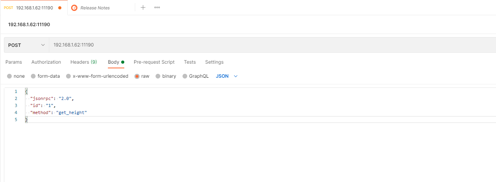

<font color='#5432F4' >Note: The jsonrpc standard is 2.0. The data in the document is all test data, and the request method is POST.
The default port is 11190. You can specify the port value in the "http_port" attribute in the configuration file config.json.</font>

#### Request example
You can use the HTTP tool Postman or Curl for access testing

##### 一、Postman example  

 

Postman： Create a new "Request" --> select "POST" --> enter the URL address, which must include the port number 11190 (such as: 192.168.1.51:11190/) --> select Body, select the Raw option, and enter the json request content.
Example:<font color='#5432F4' >{ "jsonrpc": "2.0", "method": "get_height", "id": "1" }</font>

After filling in, click the "Send" button, the server responds to the request and sends back the response content.

##### 二、Curl example
```
Curl: curl -i -X POST -H "Content-Type: application/json; indent=4" -d '{ "jsonrpc": "2.0", "method": "get_height", "id": "1" }' 192.168.1.51:11190
```

Enter the above content to access the get_height interface