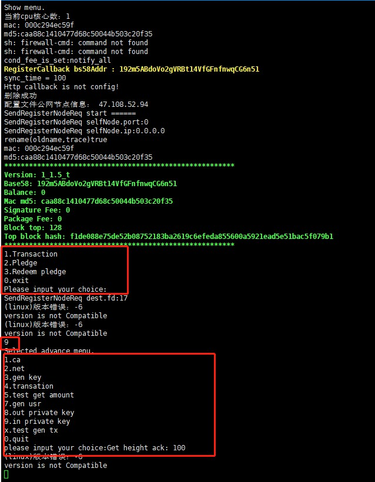

 ###  参数介绍：  
 安装文件运行时后面是可以带参数的，参数介绍如下。


|--help  |获取帮助菜单|
|:-------:|:---------:|
|-m       |显示菜单   |
|-s       |设置矿费   |
|-p       |设置打包费 |  


 ### 菜单介绍：

测试节点命令：
```
 ./uenc_xxx_testnet -m 
```

公网节点命令：

```
 ./uenc_xxx_primarynet -m 
```

程序启动之后，可以看到如下菜单：

```
	1.Transaction  
	2.Pledge  
	3.Redeem pledge  
	0.exit  
	Please input your choice: 

```

如下图所示：


### 生成账户
在执行./uenc_xxx_testnet 出现如上信息。其中的RegisterCallback bs58Addr :xxxxxxxx是本节点生成的钱包地址。请妥善保管此钱包地址，挖矿所得的收益都在这个钱包地址里面。

### 设置打包费

列如设置矿费：
测试节点：
```
    ./uenc_1.3_testnet -s  0.015
```

正式节点：
```
    ./uenc_1.3_primarynet -s  0.015
```

 
  注意：实际值 = value * 0.000001。实际值最小值：0.000001。

### 设置签名费

程序启动之后按数字9进入如下菜单

```
1.ca
2.net
3.gen key
4.transation
5.test get amount
7.gen usr
8.out private key
9.in private key
x.test gen tx
0.quit
Please input your choice: 

```

，然后按8.out private key就可以打印默认账号的私钥和助记词。



然后按1.ca进入ca菜单，然后再按9到如下菜单


```
1. Generate mnemonic words.
2. 模拟质押资产.
3. 得到本机设置的燃料费和全网节点最大最小平均值燃料费
4. 根据UTXO查询余额
5. 设置节点签名费
8. 模拟解质押资产
9. 查询账号质押资产额度
10.多账号交易
11.查询交易列表
12.查询交易详情
13.查询区块列表
14.查询区块详情
15.查询所有质押地址
16.获取5分钟内总块数
17.设置节点打包费用
18.获得所有公网节点打包费用
19.自动乱序交易(简化版)
20.测试获取前100块各个账号奖励
21.通过交易hash获取块信息
22.获取失败交易列表信息
23.获取节点高度是否符合高度范围。
```
然后在按5进入节点签名费设置


### 导出&&保存私钥

程序启动之后按数字8导出私钥，9进入如下菜单
程序启动之后按数字9进入如下菜单，然后按8.out private key就可以打印默认账号的私钥和助记词。
```
1.ca
2.net
3.gen key
4.transation
5.test get amount
7.gen usr
8.out private key
9.in private key
x.test gen tx
0.quit
```

如下图所示：
<!--  -->


### 进行转账

1.Transaction 表示发起交易，注意发起交易前需要设置矿费且矿费值在0.001与0.1之间.  
 输入1回车会让你输入自己的账号地址：
 ```
      input FromAddr :
      12GwpCQi7bWr8cbmU2r1aFia1rUQJDVXdo
 ```
 输入自己账号地址后回车此时会让你输入对方账号地址
 ```
     input ToAddr：
     1vkS46QffeM4sDMBBjuJBiVkMQKY7Z8Tu   
 ```
 输入对方账号地址后回车系统会提示让你输入交易金额
 ```
    input amount :
    999999 
 ```
 输入交易金额后回车系统会提示让你输入需要签名的数量，签名数量最小值6最大值15。
 ```
    input needVerifyPreHashCount :  
    6 
 ```
 输入签名数后回车系统提示你输入手续费注意手续费范围也是在0.001与0.1之间。
 ```
    input minerFees : 
          0.012
         
 ```
输入后回车交易发起完毕。  

### 质押
<font color='#5432F4' >测试网络质押之前，需向水龙头账号申请定量金额，进行质押、解质押操作</font>

2.Pledge 表示质押。  
出现初始菜单后输入2回车注意此时质押的账号是你自己的本机账号，系统此时提示输入质押金额：
```
  请输入要质押金额：
        325555     
```
输入金额后回车系统提示你输入矿费
```
    请输入GasFee:
    0.014
```   
输入后回车系统提示你输入密码
```
     password:
     158660
```
输入密码后回车质押完毕。

### 解质押
  3.Redeem pledge表示解质押。  
输入3回车会提示你输入解质押的账号
```
     Selected redeem pledge.
addr：
     12GwpCQi7bWr8cbmU2r1aFia1rUQJDVXdo
```
输入后回车系统列出当前账号的所有utxo
```
     -- 目前已有质押 --
utxo: e77074aa69a97ea6f018bc4ef5d4fa643e823c46ab6c59958c0e5d288befbe8d
```
输入你要解质押的utxo(复制后粘贴)回车解质押完毕。

### 挖矿
节点要想在后台实现挖矿首先自身必须要进行质押，如果不质押在发起交易的时候签名节点会被剔除，自身还有设置节点签名费，然后启动守护进程
```
./ebpc_daemon 
./ebpc_xxx_testnet 
./ebpc_xxx_testnet 

```
启动守护进程之后就不能进行config的配置也不能再次启动程序，除非杀死守护进程，在重新启动程序。