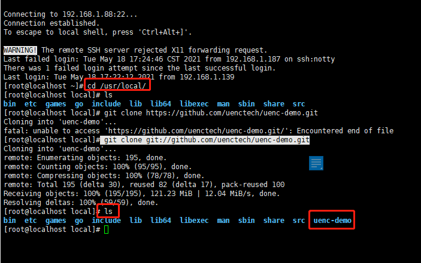
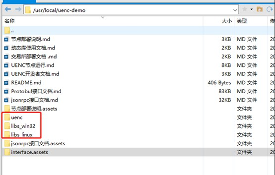

本章介绍在CentOS 7上增加一个UENC的运行节点，增加节点的安装程序，将会成了UENC大家庭中的一员。
可以在节点机上进行交易和挖矿，挖矿就是利用本机节点对交易进行签名从而获得矿费。
### 准备工作
#### 了解linux系统
##### 一、linux系统的连接

下载安装xshell。点击新建按照如下图示步骤进行链接服务器。
名称输入自己随便起的服务器别名，主机输入这台服务器的IP地址，远程连接的端口默认都是22。

 

配置好之后点击“用户身份验证”输入用户名，一般默认是“root”，密码是装系统的时候设置的密码。


xshell链接服务器：连接服务器输入密码，勾选“记住密码”。


点击确定或者连接，进入服务器。

##### 二、 linux的基础命令
这里只介绍本程序常用到的一些[linux命令](https://m.runoob.com/linux/linux-command-manual.html)，其他linux命令详见：

 * #ls         -- 查看当前文件目录
 * #chmod 755 文件名      -- 给文件赋予当前用户可读可执行权限
 * #cd  /目录          -- 到对应根目录下
 * #vim config.json  --进入文件进行编辑，按i键进行编辑修改，完成按Esc键 输入:wq!回车退出
 * 灵活运用Tab键，当控制台输入文件或目录，可以用tab键补齐文件目录。
 * 灵活运用up,down键，当要重新输入之前输过的命令，可以按up键查找，省去重新输入。

#### 部署环境准备
##### 硬件要求：
UENC程序在运行的时候需要开辟一点的内存开销。
* cpu ：4核  
* 内存：4G  
* 磁盘：至少50G

##### 操作系统：
 * CentOS 7版本(CentOS是免费的、开源的、可以重新分发的开源操作系统 ，CentOS（Community Enterprise Operating System，中文意思是社区企业操作系统）是Linux发行版之一)
* 通过购买云服务器或者实体服务器。


#### 代码准备
<font color='#5432F4' > tips:进行接下来的操作之前要先熟悉，学习linux系统控制台的[基础命令](https://m.runoob.com/linux/linux-command-manual.html)。</font>

 * 可以从github(GitHub是一个面向开源及私有软件项目的托管平台，因为只支持Git作为唯一的版本库格式进行托管，故名GitHub。)上直接[下载](https://github.com/uenctech/uenc-demo/tree/master/uenc) 适用于CentOS 7 环境下的二进制程序。  
 也可以通过以下方法下载：
 
 下载主网程序（uenc_xxx_primarynet.zip）
 ```
 git clone https://github.com/uenctech/uenc-demo.git 在uenc目录下找到uenc_xxx_primarynet.zip并解压安装。
 ```
 下载测试网程序(uenc_xxx_testnet.zip)
 ```
 git clone https://github.com/uenctech/uenc-demo.git 在uenc目录下找到uenc_xxx_testnet.zip并解压安装
 ```
 


 下载后修改下载的安装文件的执行权限并解压缩。  
 修改执行权限
 ```
 chmod 755 uenc_1.3_testnet.zip
 ```


如上图可见，压缩文件.zip从<font color='#ff5555' >红色</font>变成了<font color='#55ff55' >绿色</font>。这也是判断是否权限赋予成功的标志。
解压
 ```
 unzip uenc_1.3_testnet.zip
 ```
    


### 文件结构介绍
解压缩完成之后查看文件结构

 ```
 ls
 ```


 
或者xftp查看


 

 | 文件或目录 |     描述     | 
 | :--------: | :--------------: | 
 |   .md   | 以此后缀结尾的文档是提供给用户阅读的，其中包括开发对接文档 | 
 |   .assets   | 是存放uenc主网的逻辑结构图，用户可以根据兴趣阅读 | 
 |   uenc   | 本机访问密码哈希值，当移动端连接时使用该密码进行连接 | 
 |   libs_linux   | 是提供给开发者对接主网liunx系统用到的静态库文件 | 
 |   libs_win32   | 是提供给开发者对接主网windows系统用到的静态库文件 | 

 ### 节点配置
进入到uenc目录 #cd uenc_1.5_xxx
 * 运行获取的安装文件
<font color='#5432F4' >tips:运行之前查看文件是否赋予可读可执行权限</font>
 ```
 ./uenc_1.3_testnet
 ```
 * 执行后按Ctrl + C退出当前程序，此时会在当前目录中生成如下文件和目录
 
 | 文件或目录 |     描述     | 
 | :--------: | :--------------: | 
 |   cert   | 存放生成的公私密钥对，后缀为".public.key"的文件是公钥文件，后缀为".private.key"为私钥文件 | 
 |   data.db   | 数据库文件 | 
 |   devpwd.json   | 本机访问密码哈希值，当移动端连接时使用该密码进行连接 | 
 |   config.json   | 配置文件 | 
 |   log.txt   | 日志文件 | 


 #### 配置文档修改

 修改配置文件config.json，自己是子网节点无需配置，可按默认配置直接运行。
 
 ```
vim config.json

 ```

编辑完成，进行退出。重新执 行./uenc_1.xx_xxx 命令，执行生效。

 如果自己是公网节点按照如下方式进行修改：
 1. 需要将is_public_node的值由false修改为true。
 2. 将server中的IP字段的值设置为自身节点所连接的其他公网节点IP地址。
 3. 将var字段下的local_ip字段设置为自身节点的外网IP地址。

 例如，自身节点外网IP地址为xxx.xxx.xxx.xxx, 所连接公网地址为yyy.yyy.yyy.yyy, 则按如下配置（以测试网公网节点配置为例）
 ```
	  "is_public_node": true,
    "server": [
        {
            "IP": "yyy.yyy.yyy.yyy",
            "PORT": 11188
        },
    ],
    "var": {
    "k_bucket": "a0dbbd80eb84b9e51f3a0d69727384c651f9bdb5",
    "k_refresh_time": 100,
    "local_ip": "xxx.xxx.xxx.xxx",
    "local_port": 11188,
    "work_thread_num": 4
    },

 ```
 


