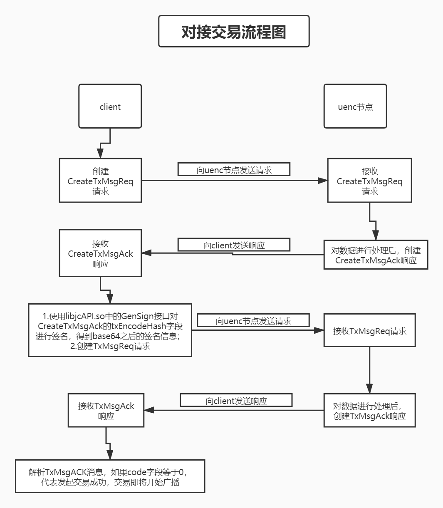

## 一、设置设备密码接口（SetDevPasswordReq）

1. 请求

   ```dict
   message SetDevPasswordReq 
   {
       string version = 1;
       string old_pass = 2;
       string new_pass = 3;
   }
   ```
   
   |   字段   |         说明         |
   | :------: | :------------------: |
   | version  |        版本号        |
   | old_pass |        旧密码        |
   | new_pass |        新密码        |
   
2. 响应

   ```dict
   message SetDevPasswordAck 
   {
       string version = 1;
       sint32 code = 2;
       string description = 3;
   }
   ```

    |    字段     |                             说明                             |
   | :---------: | :----------------------------------------------------------: |
   |   version   |                         版本号                               |
   |    code     | 0成功; -1参数错误; -2 密码不能为空; -3旧密码非法（特殊字符或长度超过8个字节）; -4 新密码非法（特殊字符或长度超过8个字节）; -5 新旧密码不能相同; -6 旧密码验证不正确; -7 未知错误 |
   | description |                       返回值的文字描述                       |
3. 代码示例

```python
# 设置设备密码接口（SetDevPasswordReq）
def SetDevPasswordRequest():
    # 固定参数(参数可修改)
    HOST = '192.168.1.141'
    PORT = 11187
    VERSION = '1_1.3_p'
    OLD_PASS = 11111111
    NEW_PASS = 12345678

    # 创建socket请求
    pd = socket.socket(socket.AF_INET, socket.SOCK_STREAM)
    ADDR = (HOST, PORT)
    # 连接服务器
    pd.connect(ADDR)
    # 发送数据
    addr = protobuf_pb2.SetDevPasswordReq()
    addr.version = VERSION
    addr.old_pass = str(OLD_PASS)
    addr.new_pass = str(NEW_PASS)

    common = protobuf_pb2.CommonMsg()
    common.version = VERSION
    common.type = 'SetDevPasswordReq'
    # 序列化
    common.data = addr.SerializeToString()
    sendData = common.SerializeToString()
    # 获取协议总长度
    data_len = len(sendData) + 4 + 4
    data_len_ = ('<i%dsIi' % (data_len - 8))
    end_flag = 7777777
    # 拼接消息
    Splicing_String = struct.pack(data_len_, data_len, sendData, adler32(sendData), end_flag)
    pd.send(Splicing_String)
    target = protobuf_pb2.SetDevPasswordAck()

       while True:
        reply = pd.recv(4)
        time.sleep(0.1)
        # 接收前四个字节，解析数据长度
        test = int.from_bytes(reply, byteorder='little')
        # 根据数据长度再次接收数据
        reply2 = pd.recv(test)
        # 将接收到的数据的最后8字节删除,最后8字节的内容是校验和、end_flag
        reply3 = reply2[:(test - 8)]
        # 反序列化reply3
        common.ParseFromString(reply3)
        target.ParseFromString(common.data)
        # 格式化数据，并转为字典格式
        message_SetDevPasswordAck = protobuf_to_dict(target)
        json_output = json.dumps(message_SetDevPasswordAck, indent=4, ensure_ascii=False)
        # 返回json数据
        return json_output
```

## 二、设置矿工费请求接口（SetServiceFeeReq）

1. 请求

   ```dict
   message SetServiceFeeReq
   {
   	string version = 1;			
   	string password = 2;					
   	string service_fee = 3;					
   }
   ```

   |     字段     |         说明         |
   | :---------: | :------------------: |
   |   version   |        版本号         |
   |  password   |       节点密码       |
   | service_fee |        设定值        |

2. 响应

   ```dict
   message SetServiceFeeAck
   {
   	string version = 1;				
   	sint32 code = 2;					
   	string description = 3;					
   }
   ```

   |    字段     |                   说明                    |
   | :---------: | :---------------------------------------: |
   |   version   |                版本号                   |
   |    code     | 0成功; -6 密码错误; -7 滑动条数值显示错误 |
   | description |             返回值的文字描述              |
3. 代码示例

```python
# 设置矿工费请求接口（SetServiceFeeReq）
def SetServiceFeeRequest():
    # 固定参数(参数可修改)
    HOST = '192.168.1.141'
    PORT = 11187
    VERSION = '1_1.3_p'
    PASSWORD = 12345678
    SERVICE_FEE = 0.01

    # 创建socket请求
    pd = socket.socket(socket.AF_INET, socket.SOCK_STREAM)
    ADDR = (HOST, PORT)
    # 连接服务器
    pd.connect(ADDR)
    # 发送数据
    addr = protobuf_pb2.SetServiceFeeReq()
    addr.version = VERSION
    addr.password = str(PASSWORD)
    addr.service_fee = str(SERVICE_FEE)
    data_len_ = len(addr.service_fee)
    sum_ = (58 + data_len_) - 8
    data_len_ = ('<i%dsIi' % sum_)

    common = protobuf_pb2.CommonMsg()
    common.version = VERSION
    common.type = 'SetServiceFeeReq'
    # 序列化
    common.data = addr.SerializeToString()
    sendData = common.SerializeToString()
    # 获取协议总长度
    data_len = len(sendData) + 4 + 4
    end_flag = 7777777

    
    # 拼接消息
    Splicing_String = struct.pack(data_len_, data_len, sendData, adler32(sendData), end_flag)
    pd.send(Splicing_String)
    target = protobuf_pb2.SetServiceFeeAck()
    while True:
        reply = pd.recv(4)
        time.sleep(0.1)
        # 接收前四个字节，解析数据长度
        test = int.from_bytes(reply, byteorder='little')
        # 根据数据长度再次接收数据
        reply2 = pd.recv(test)
        # 将接收到的数据的最后8字节删除,最后8字节的内容是校验和、end_flag
        reply3 = reply2[:(test - 8)]
        # 反序列化reply3
        common.ParseFromString(reply3)
        target.ParseFromString(common.data)
        # 格式化数据，并转为字典格式
        message_SetServiceFeeAck = protobuf_to_dict(target)
        json_output = json.dumps(message_SetServiceFeeAck, indent=4, ensure_ascii=False)
        # 返回json数据
        return json_output
```

## 三、获取账户余额接口（GetAmountReq）

1. 请求
   ```dict
   message GetAmountReq 
   {
       string version = 1;
       string address = 2;
   }
   ```

   |  字段   |         说明         |
   | :-----: | :------------------: |
   | version |          版本号        |
   | address |       钱包地址       |

2. 响应

   ```dict
   message GetAmountAck 
   {
       string version = 1;
       sint32 code = 2;
       string description = 3;
       string address = 4;
       string balance = 5;
   }
   ```

   |    字段     |              说明               |
   | :---------: | :-----------------------------: |
   |   version   |            版本号             |
   |    code     | 返回0为成功, -1为钱包地址不可用 |
   | description |        返回值的文字描述         |
   |   address   |            钱包地址             |
   |   balance   |              余额               |
3. 代码示例


```python
# 获取账户余额接口（GetAmountReq）
def GetAmountRequest():
    # 固定参数(参数可修改)
    HOST = '192.168.1.141'
    PORT = 11187
    VERSION = '1_1.3_p'
    ADDRESS = '13C4UmhB7tKGdXiJrp2GKsJtmCoJeqGJQz'

    # 创建socket请求
    pd = socket.socket(socket.AF_INET, socket.SOCK_STREAM)
    ADDR = (HOST, PORT)
    # 连接服务器
    pd.connect(ADDR)
    # 发送数据
    addr = protobuf_pb2.GetAmountReq()
    addr.version = VERSION
    addr.address = ADDRESS

    common = protobuf_pb2.CommonMsg()
    common.version = VERSION
    common.type = 'GetAmountReq'
    # 序列化
    common.data = addr.SerializeToString()
    sendData = common.SerializeToString()
    # 获取协议总长度
    data_len = len(sendData) + 4 + 4
    data_len_ = ('<i%dsIi' % (data_len - 8))
    end_flag = 7777777  # 结束标志位

    # 拼接消息
    Splicing_String = struct.pack(data_len_, data_len, sendData, adler32(sendData), end_flag)
    pd.send(Splicing_String)
    target = protobuf_pb2.GetAmountAck()
    while True:
        reply = pd.recv(4)
        # 接收前四个字节，解析数据长度
        test = int.from_bytes(reply, byteorder='little')
        # 根据数据长度再次接收数据
        reply2 = pd.recv(test)
        # 将接收到的数据的最后8字节删除,最后8字节的内容是校验和、end_flag
        reply3 = reply2[:(test - 8)]
        # 反序列化reply3
        common.ParseFromString(reply3)
        target.ParseFromString(common.data)
        # 格式化数据，并转为字典格式
        message_GetAmountAck = protobuf_to_dict(target)
        json_output = json.dumps(message_GetAmountAck, indent=4, ensure_ascii=False)
        # 返回json数据
        return json_output
```

<!-- ## 五、获取特定节点打包费接口（GetPacketFeeReq）已废弃deprecated
1. 请求

   ```dict
   message GetPacketFeeReq 
   {
   	string version = 1;					
   	string password = 2;					
   	string public_net_ip = 3;						
   }
   ```

   |     字段      |         说明         |
   | :-----------: | :------------------: |
   |    version    |       版本号         |
   |   password    |       节点密码       |
   | public_net_ip | 当前连接的的公网的ip |

2. 响应

   ```dict
   message GetPacketFeeAck 
   {
       string version = 1;
       sint32 code = 2;
       string description = 3;
       string packet_fee = 4;
   }
   ```

   |    字段     |         说明         |
   | :---------: | :------------------: |
   |   version   |          版本号        |
   |    code     |        0成功         |
   | description |   返回值的文字描述   |
   | packet_fee  |        打包费        |
3. 代码示例

```python
# 获取特定节点打包费接口（GetPacketFeeReq）
def GetPacketFeeRequest():
    # 固定参数(参数可修改)
    HOST = '192.168.1.141'
    PORT = 11187
    VERSION = '1_1.3_p'
    PASSWORD = 12345678
    PUBLIC_NET_IP = '47.108.52.94'

    # 创建socket请求
    pd = socket.socket(socket.AF_INET, socket.SOCK_STREAM)
    ADDR = (HOST, PORT)
    # 连接服务器
    pd.connect(ADDR)
    # 发送数据
    addr = protobuf_pb2.GetPacketFeeReq()
    addr.version = VERSION
    addr.password = str(PASSWORD)
    addr.public_net_ip = PUBLIC_NET_IP

    common = protobuf_pb2.CommonMsg()
    common.version = VERSION
    common.type = 'GetPacketFeeReq'
    # 序列化
    common.data = addr.SerializeToString()
    sendData = common.SerializeToString()
    # 获取协议总长度
    data_len = len(sendData) + 4 + 4
    data_len_ = ('<i%dsIi' % (data_len - 8))
    end_flag = 7777777

    # 拼接消息
    Splicing_String = struct.pack(data_len_, data_len, sendData, adler32(sendData), end_flag)
    pd.send(Splicing_String)
    target = protobuf_pb2.GetPacketFeeAck()
    while True:
        reply = pd.recv(4)
        time.sleep(0.1)
        # 接收前四个字节，解析数据长度
        test = int.from_bytes(reply, byteorder='little')
        # 根据数据长度再次接收数据
        reply2 = pd.recv(test)
        # 将接收到的数据的最后8字节删除,最后8字节的内容是校验和、end_flag
        reply3 = reply2[:(test - 8)]
        # 反序列化reply3
        common.ParseFromString(reply3)
        target.ParseFromString(common.data)
        # 格式化数据，并转为字典格式
        message_GetPacketFeeReq = protobuf_to_dict(target)
        json_output = json.dumps(message_GetPacketFeeReq, indent=4, ensure_ascii=False)
        # 返回json数据
        return json_output
``` -->

##  四、获得全网节点矿费接口（GetNodeServiceFeeReq）

1. 请求

   ```
   message GetNodeServiceFeeReq 
   {
       string version 							= 1;
   }
   ```

   |  字段   |         说明         |
   | :-----: | :------------------: |
   | version | 版本，目前暂时可为空 |

2. 响应

   ```
   message GetNodeServiceFeeAck 
   {
       string version 							= 1;
       sint32 code 							= 2;
       string description 						= 3;
   
       repeated ServiceFee service_fee_info 	= 4;
   }
   message ServiceFee
   {
   	string max_fee 		= 1;
   	string min_fee 		= 2;
   	string service_fee 	= 3;
       string avg_fee 		= 4;
   }
   ```

   |       字段       |          说明          |
   | :--------------: | :--------------------: |
   |     version      |  版本，目前暂时可为空  |
   |       code       |         0成功          |
   |   description    |    返回值的文字描述    |
   | service_fee_info | 节点矿费信息结构体数组 |
   |     max_fee      |   前一百块交易最大值   |
   |     min_fee      |   前一百块交易最小值   |
   |   service_fee    |     矿工设置的矿费     |
   |     avg_fee      |   前一百块交易平均值   |


## 五、根据密码获取钱包地址接口（GetDevPasswordReq）

1. 请求

   ```dict
   message GetDevPasswordReq 
   {
       string version = 1;
       string password = 2;
   }
   ```

   |   字段   |         说明         |
   | :------: | :------------------: |
   | version  |        版本号         |
   | password |         密码         |

2. 响应

   ```dict
   message GetDevPasswordAck 
   {
       string version = 1;
       sint32 code = 2;
       string description = 3;
       string address = 4;
   }
   ```

   |    字段     |         说明         |
   | :---------: | :------------------: |
   |   version   |       版本号         |
   |    code     |  0成功; -2 密码错误  |
   | description |   返回值的文字描述   |
   |   address   |       钱包地址       |

3.代码示例

```python
# 根据密码获取钱包地址接口（GetDevPasswordReq）
def GetDevPasswordRequest():
    # 固定参数(参数可修改)
    HOST = '192.168.1.141'
    PORT = 11187
    VERSION = '1_1.3_p'
    PASSWODR = 12345678

    # 创建socket请求
    pd = socket.socket(socket.AF_INET, socket.SOCK_STREAM)
    ADDR = (HOST, PORT)
    # 连接服务器
    pd.connect(ADDR)
    # 发送数据
    addr = protobuf_pb2.GetDevPasswordReq()
    addr.version = VERSION
    addr.password = str(PASSWODR)

    common = protobuf_pb2.CommonMsg()
    common.version = VERSION
    common.type = 'GetDevPasswordReq'
    # 序列化
    common.data = addr.SerializeToString()
    sendData = common.SerializeToString()
    # 获取协议总长度
    data_len = len(sendData) + 4 + 4
    data_len_ = ('<i%dsIi' % (data_len - 8))
    end_flag = 7777777

    # 拼接消息
    Splicing_String = struct.pack(data_len_, data_len, sendData, adler32(sendData), end_flag)
    pd.send(Splicing_String)
    target = protobuf_pb2.GetDevPasswordAck()
    while True:
        reply = pd.recv(4)
        time.sleep(0.1)
        # 接收前四个字节，解析数据长度
        test = int.from_bytes(reply, byteorder='little')
        # 根据数据长度再次接收数据
        reply2 = pd.recv(test)
        # 将接收到的数据的最后8字节删除,最后8字节的内容是校验和、end_flag
        reply3 = reply2[:(test - 8)]
        # 反序列化reply3
        common.ParseFromString(reply3)
        target.ParseFromString(common.data)
        # 格式化数据，并转为字典格式
        message_GetDevPasswordReq = protobuf_to_dict(target)
        json_output = json.dumps(message_GetDevPasswordReq, indent=4, ensure_ascii=False)
        # 返回json数据
        return json_output
```

##  六、从服务器端获得客户端相关信息接口（GetClientInfoReq）

1. 请求

   ```
   message GetClientInfoReq 
   {
       string version 			= 1;
       DeviceType phone_type 	= 2;
       DeviceLang phone_lang 	= 3;
       string phone_version 	= 4;
   }
   ```

   |     字段      |         说明         |
   | :-----------: | :------------------: |
   |    version    | 版本，目前暂时可为空 |
   |  phone_type   |      客户端类型      |
   |  phone_lang   |       所选语言       |
   | phone_version |    客户端所用版本    |

2. 响应

   ```
   message GetClientInfoAck 
   {
       string version 		= 1;
       sint32 code 		= 2;
       string description 	= 3;
   
       string min_version 	= 4;
       string is_update 	= 5;
       string ver 			= 6;
       string desc 		= 7;
       string dl 			= 8 ;
   }
   enum DeviceType {
       PC 					= 0;
       iOS 				= 1;
       Android 			= 2;
   }
   enum DeviceLang {
       ZH_CN 				= 0;
       EN_US 				= 1;
   }
   ```

   |    字段     |                             说明                             |
   | :---------: | :----------------------------------------------------------: |
   |   version   |                     版本，目前暂时可为空                     |
   |    code     | -1,参数错误; -2,获得客户端信息错误，此情况是需要更新但是获得客户端下载信息是失败; 0 操作成功，但不需要更新，isUpdate为0，无客户端下载信息; 1 操作成功，包含所有字段信息 |
   | description |                       返回值的文字描述                       |
   | min_version |               服务器程序所支持的最小客户端版本               |
   |  is_update  |             是否升级, 1为需要升级, 0为不需要升级             |
   |     ver     |                     所需下载客户端的版本                     |
   |    desc     |                   所需下载客户端的描述信息                   |
   |     dl      |                     所需下载客户端的Url                      |
   |     PC      |                             pc端                             |
   |     iOS     |                            ios端                             |
   |   Android   |                          android端                           |
   |    ZH_CN    |                             中文                             |
   |    EN_US    |                             英文                             |


##  七、获取公网节点信息接口（GetNodeInfoReq）

1. 请求

   ```
   message GetNodeInfoReq 
   {
       string version = 1;
   }
   ```

   |  字段   | 说明 |
   | :-----: | :--: |
   | version | 版本 |

2. 响应

   ```
   message GetNodeInfoAck 
   {
       string version 					= 1;
       sint32 code 					= 2;
       string description 				= 3;
   
       repeated NodeList node_list 	= 4;
   }
   message NodeList 
   {
       repeated NodeInfos node_info 	= 1;
       string local 					= 2;
   }
   message NodeInfos 
   {
       string enable 					= 1;
       string ip 						= 2;
       string name 					= 3;
       string port 					= 4;
       string price 					= 5;
   }
   ```

   |    字段     |         说明         |
   | :---------: | :------------------: |
   |   version   | 版本，目前暂时可为空 |
   |    code     |  0成功；-1获取失败   |
   | description |   返回值的文字描述   |
   |  node_list  |  节点信息结构体数组  |
   |  node_info  |    节点信息结构体    |
   |    local    |         地区         |
   |   enable    |     节点是否可用     |
   |     ip      |        节点ip        |
   |    name     |       节点名称       |
   |    port     |       节点端口       |
   |    price    |         废弃         |


## 八、获取平均手续费、同步状态等信息接口（GetServiceInfoReq）

1. 请求

   ```dict
   message GetServiceInfoReq
   {
       string version = 1;
       string password = 2;	
       string public_net_ip = 3;
       bool is_show = 4;
       uint32 sequence_number = 5;                       
   }
   ```

   |     字段      |                         说明                          |
   | :-----------: | :---------------------------------------------------: |
   |    version    |                 版本号                                |
   |   password    |               手机端密码(暂时不需要传)                |
   | public_net_ip |                      公网节点IP                       |
   |    is_show    | 非直连(通过节点)公网节点 需要传true(club可忽视此参数) |
   |sequence_number|  请求的序列号 (请求的时候传入什么值就会返回什么值)    |
2. 响应

   ```dict
   message GetServiceInfoAck
   {
       string version = 1;
       sint32 code = 2;
       string description = 3;
       string mac_hash = 4;
       string device_version = 5;
       repeated ServiceFee service_fee_info = 6;
       enum SyncStatus
       {
           TRUE = 0;
           FALSE = 1;
           FAIL = -1;	
       }
   
       SyncStatus is_sync = 7;
       sint32 height = 8; //节点高度
       uint32 sequence = 9; //回应的序列号
   }
   message ServiceFee
   {
       string max_fee = 1;
       string min_fee = 2;
       string service_fee = 3;
       string avg_fee = 4;
   }
   ```

   |       字段       |                            说明                             |
   | :--------------: | :---------------------------------------------------------: |
   |     version      |                                版本号                        |
   |       code       |   0为成功; -1 版本错误返回值的文字描述; -404 连接公网超时   |
   |   description    |                          返回描述                           |
   |     mac_hash     |                            废弃                             |
   |  device_version  |                        节点程序版本                         |
   | service_fee_info |                   ServiceFee 手续费结构体                   |
   |     is_sync      |                  SyncStatus 是否同步枚举值                  |
   |    SyncStatus    |      0 与主网同步; 1 与主网未同步; -1 获得主网信息失败      |
   |     max_fee      |                     前一百块交易最大值                      |
   |     min_fee      |                     前一百块交易最小值                      |
   |   service_fee    |                       矿工设置的矿费                        |
   |     avg_fee      |                     前一百块交易平均值                      |
   |    SyncStatus    | 0 节点与主网已同步; 1 节点与主网未同步; -1 获取主网信息失败 |
   |     height       |    节点高度或者公网高度(请求的是节点就是节点高度，请求的是公网就是公网高度)|                                                         |
   | sequence         |      请求端传入的序列号(请求端传入什么数据返回什么数据)|
3. 代码示例

```python
# 获取平均手续费、同步状态等信息接口（GetServiceInfoReq）
def GetServiceInfoRequest():
    # 固定参数(参数可修改)
    HOST = '192.168.1.141'
    PORT = 11187
    VERSION = '1_1.3_p'
    PASSWORD = 12345678
    IS_SHOW = True
    SEQUENCE_NUMBER = 1

    # 创建socket请求
    pd = socket.socket(socket.AF_INET, socket.SOCK_STREAM)
    ADDR = (HOST, PORT)
    # 连接服务器
    pd.connect(ADDR)
    # 发送数据
    addr = protobuf_pb2.GetServiceInfoReq()
    addr.version = VERSION
    addr.password = str(PASSWORD)
    addr.public_net_ip = HOST
    addr.is_show = IS_SHOW
    addr.sequence_number = SEQUENCE_NUMBER

    common = protobuf_pb2.CommonMsg()
    common.version = VERSION
    common.type = 'GetServiceInfoReq'
    # 序列化
    common.data = addr.SerializeToString()
    sendData = common.SerializeToString()
    # 获取协议总长度
    data_len = len(sendData) + 4 + 4
    data_len_ = ('<i%dsIi' % (data_len - 8))
    end_flag = 7777777

    # 拼接消息
    Splicing_String = struct.pack(data_len_, data_len, sendData, adler32(sendData), end_flag)
    pd.send(Splicing_String)
    target = protobuf_pb2.GetServiceInfoAck()
    while True:
        reply = pd.recv(4)
        time.sleep(0.1)
        # 接收前四个字节，解析数据长度
        test = int.from_bytes(reply, byteorder='little')
        # 根据数据长度再次接收数据
        reply2 = pd.recv(test)
        # 将接收到的数据的最后8字节删除,最后8字节的内容是校验和、end_flag
        reply3 = reply2[:(test - 8)]
        # 反序列化reply3
        common.ParseFromString(reply3)
        target.ParseFromString(common.data)
        # 格式化数据，并转为字典格式
        message_GetServiceInfoReq = protobuf_to_dict(target)
        json_output = json.dumps(message_GetServiceInfoReq, indent=4, ensure_ascii=False)
        # 返回json数据
        return json_output
```

##  九、发起交易接口



### 1.主网地址发起交易接口（CreateTxMsgReq）
交易分两步

第一步:

1. 请求

   ```
   message CreateTxMsgReq
   {
   	string version           		= 1;
   	string from 					= 2;
   	string to 						= 3;
   	string amt 						= 4;	
   	string minerFees 				= 5;
   	string needVerifyPreHashCount 	= 6;
   }
   ```

   |          字段          |               说明               |
   | :--------------------: | :------------------------------: |
   |        version         |               版本              |
   |          from          |          发起方钱包地址          |
   |           to           |          接收方钱包地址          |
   |          amt           |             交易金额             |
   |       minerFees        | 发起交易方支付的单个签名的矿工费 |
   | needVerifyPreHashCount |            签名共识数            |
   |        version         |              版本号              |

2. 响应

   ```
   message CreateTxMsgAck
   {
   	string       version        = 1;                    					
   	int32        code			= 2;					
   	string		 message		= 3;					
   	string 		 txData			= 4;					
   	string       txEncodeHash   = 5;						
   }
   ```
   
   |     字段     |                        说明                         |
   | :----------: | :-------------------------------------------------: |
   |   version    |                        版本                         |
|     code     | 0 为成功; -1 版本错误;  -2 参数错误 ; -3 utxo未找到 |
   |   message    |                      返回描述                       |
   |    txData    |                     交易信息体                      |
   | txEncodeHash |         交易信息体base64之后sha256的hash值          |


第二步：

1. 请求

   ```
   message TxMsgReq
   {
   	string       version        = 1;                     				
   	string		 serTx			= 2;					
   	string		 strSignature	= 3;					
   	string		 strPub			= 4;					
   	string       txEncodeHash   = 5;						
   }
   ```
   
   |     字段     |                             说明                             |
   | :----------: | :----------------------------------------------------------: |
   |   version    |                             版本                             |
   |    serTx     |                     为第一次响应的txData                     |
   | strSignature |                    base64编码后的签名信息                    |
|    strPub    | 发起方公钥，需要base64编码。如果调用C动态库生成的公钥，需要将十六进制的字符串还原成二进制，再base64编码 |
   | txEncodeHash |                  为第一次响应的txEncodeHash                  |
   
2. 响应

   ```
   message TxMsgAck
   {
   	string       version        = 1;                        			
   	int32        code			= 2;					
   	string		 message		= 3;					
   	string       txHash         = 4;                     
   }
   ```
   
   |  字段   |                             说明                             |
   | :-----: | :----------------------------------------------------------: |
   | version |                             版本                             |
   |  code   | 0为发起交易成功，交易开始广播;; -1 版本错误; -2 反序列交易失败; -3 交易体无效; -4 数据库创建事务失败; -5 (未使用); -7 已经签名; -8 验证签名失败; -9 获取本节点签名费失败; -10 发起交易方支付的 GasFee 为 0; -11 未找到匹配的签名节点; |
| message |                           返回描述                           |
   | txHash  |                           交易hash                           |


### 2.手机端多重交易接口（CreateMultiTxMsgReq）

 交易分两步

 第一步:

1. 请求

   ```
   message CreateMultiTxMsgReq
   {
   	string       version        	= 1;                  				
   	repeated string from			= 2;					
   	repeated ToAddr to		    	= 3;						
   	string minerFees				= 5;					
   	string needVerifyPreHashCount 	= 6;						
   }
   message ToAddr
   {
   	string toAddr              	 	= 1;
   	string amt                  	= 2; 
   }
   ```

   |          字段          |               说明               |
   | :--------------------: | :------------------------------: |
   |        version         |               版本               |
   |          from          |          发起方钱包地址          |
   |           to           |        接收方钱包地址数组        |
   |       minerFees        | 发起交易方支付的单个签名的矿工费 |
   | needVerifyPreHashCount |              共识数              |
   |         toAddr         |          接收方钱包地址          |
   |          amt           |               金额               |

2. 响应

   ```
   message CreateMultiTxMsgAck
   {
   	string       version        = 1;                       					
   	int32        code			= 2;					
   	string		 message		= 3;					
   	string 		 txData			= 4;						
   	string       txEncodeHash   = 5;						
   }
   ```

   |     字段     |                        说明                         |
   | :----------: | :-------------------------------------------------: |
   |   version    |                        版本                         |
   |     code     | 0 为成功; -1 版本错误;  -2 参数错误 ; -3 utxo未找到 |
   |   message    |                      返回描述                       |
   |    txData    |                     交易信息体                      |
   | txEncodeHash |         交易信息体base64之后sha256的hash值          |


 第二步：

1. 请求

   ```
   message MultiTxMsgReq
   {
   	string       version        = 1;                      				
   	string		 serTx			= 2;					
   	repeated SignInfo signInfo	= 3;						
   	string       txEncodeHash   = 4;						
   }
   message SignInfo
   {
   	string signStr              = 1;
   	string pubStr               = 2;
   }
   ```

   |     字段     |            说明            |
   | :----------: | :------------------------: |
   |   version    |            版本            |
   |    serTx     |    为第一次响应的txData    |
   |   signInfo   |        签名信息数组        |
   | txEncodeHash | 为第一次响应的txEncodeHash |
   |   signStr    |   base64之后签名信息 ？    |
   |    pubStr    |     base64之后公钥 ？      |

2. 响应

   ```
   message TxMsgAck
   {
   	string       version        = 1;                    				
   	int32        code			= 2;					
   	string		 message		= 3;						
   	string       txHash         = 4;                        
   }
   ```

   |  字段   |                             说明                             |
   | :-----: | :----------------------------------------------------------: |
   | version |                             版本                             |
   |  code   | 0为发起交易成功，交易开始广播; -1 版本错误; -2 反序列交易失败; -3 交易体无效; -4 数据库创建事务失败; -5 (未使用); -7 已经签名; -8 验证签名失败; -9 获取本节点签名费失败; -10 发起交易方支付的 GasFee 为 0; -11 未找到匹配的签名节点 |
   | message |                           返回描述                           |
   | txHash  |                           交易hash                           |


### 3.手机端连接节点，控制节点发起交易发起交易接口（CreateDeviceTxMsgReq）

交易分两步

第一步验证密码:

1. 请求

   ```
   message VerifyDevicePasswordReq
   {
   	string       version        = 1;                   				
   	string       password       = 2;                    
   }
   ```

   |   字段   | 说明 |
   | :------: | :--: |
   | version  | 版本 |
   | password | 密码 |

2. 响应

   ```
   message VerifyDevicePasswordAck
   {
   	string       version        = 1;                      				
   	int32        code			= 2;					
   	string		 message		= 3;						
   }
   ```

   |  字段   |    说明    |
   | :-----: | :--------: |
   | version |    版本    |
   |  code   | 返回错误码 |
   | message |  返回描述  |


 第二步发起交易：

1. 请求

   ```
   message CreateDeviceTxMsgReq
   {
   	string version        			= 1;                       				
   	string from						= 2;					
   	string to						= 3;					
   	string amt						= 4;					
   	string minerFees				= 5;						
   	string needVerifyPreHashCount 	= 6;
    string password                 = 7;						
   }
   ```

   |          字段          |               说明               |
   | :--------------------: | :------------------------------: |
   |        version         |               版本               |
   |          from          |          交易发起方地址          |
   |           to           |          交易接收方地址          |
   |          amt           |             交易金额             |
   |       minerFees        | 发起交易方支付的单个签名的矿工费 |
   | needVerifyPreHashCount |              共识数              |
   |        password        |              节点密码              |

2. 响应

   ```
   message TxMsgAck
   {
   	string       version        = 1;                    				
   	int32        code			= 2;					
   	string		 message		= 3;						
   	string       txHash         = 4;                        
   }
   ```

   |  字段   |                             说明                             |
   | :-----: | :----------------------------------------------------------: |
   | version |                             版本                             |
   |  code   | 0为发起交易成功，交易开始广播; -1 版本错误; -2 反序列交易失败; -3 交易体无效; -4 数据库创建事务失败; -5 (未使用); -7 已经签名; -8 验证签名失败; -9 获取本节点签名费失败; -10 发起交易方支付的 GasFee 为 0; -11 未找到匹配的签名节点; |
   | message |                           返回描述                           |
   | txHash  |                         为空，无数据                         |


### 4.手机端连接节点发起多重交易接口（CreateDeviceMultiTxMsgReq）

1. 请求

   ```
   message CreateDeviceMultiTxMsgReq
   {
   	string       version        	= 1;                      					
   	repeated string from			= 2;						
   	repeated ToAddr to		    	= 3;						
   	string gasFees			    	= 4;						
   	string needVerifyPreHashCount 	= 5;
    string password                 = 6;
   }
   ```

   |          字段          |               说明               |
   | :--------------------: | :------------------------------: |
   |        version         |               版本               |
   |          from          |          交易发起方地址          |
   |           to           |          交易接收方地址          |
   |        gasFees         | 发起交易方支付的单个签名的矿工费 |
   | needVerifyPreHashCount |              共识数              |
   |        password        |              节点密码              |

2. 响应

   ```
   message TxMsgAck
   {
   	string       version        = 1;                    				
   	int32        code			= 2;					
   	string		 message		= 3;						
   	string       txHash         = 4;                        
   }
   ```

   |  字段   |                             说明                             |
   | :-----: | :----------------------------------------------------------: |
   | version |                             版本                             |
   |  code   | 0为发起交易成功，交易开始广播; -1 版本错误; -2 反序列交易失败; -3 交易体无效; -4 数据库创建事务失败; -5 (未使用); -7 已经签名; -8 验证签名失败; -9 获取本节点签名费失败; -10 发起交易方支付的 GasFee 为 0; -11 未找到匹配的签名节点; |
   | message |                           返回描述                           |
   | txHash  |                           交易hash                           |


## 十、查询块信息接口（GetBlockInfoReq）

1. 请求

   ```dict
   message GetBlockInfoReq 
   {
       string version = 1;
       sint32 height = 2;
       sint32 count = 3;
   }
   ```

   |  字段   |         说明         |
   | :-----: | :------------------: |
   | version |         版本号       |
   | height  |         高度         |
   |  count  |  一共需要查询的块数  |

2. 响应

   ```dict
   message GetBlockInfoAck {
       string version = 1;
       sint32 code = 2;
       string description = 3;
   
       //data
       uint64 top = 4; 
       repeated BlockInfo block_info_list = 5;
       uint64 tx_count = 6; 
   }
   message BlockInfo 
   {
       sint32 height = 1;
       string hash_merkle_root = 2;
       string hash_prev_block = 3;
       string block_hash = 4;
       uint64 ntime = 5;
       repeated TxInfo tx_info_list = 6;
       string packet_fee = 7;
       string packet_ip = 8;
   }
   message TxInfo 
   {
       string tx_hash = 1;
       repeated string transaction_signer = 2;
       repeated TxVinInfo vin_list = 3;
       repeated TxVoutInfo vout_list = 4;
       uint64 nlock_time = 5;
       string stx_owner = 6;
       uint64 stx_owner_index = 7;
       uint32 version = 8;
   }
   message TxVinInfo 
   {
       string script_sig = 1;
       string pre_vout_hash = 2;
       uint64 pre_vout_index = 3;
   }
   message TxVoutInfo 
   {
       string script_pubkey = 1;
       string amount = 2;
   }
   ```

   |        字段        |               说明                |
   | :----------------: | :-------------------------------: |
   |      version       |              版本号               |
   |        code        |              返回值               |
   |    description     |             返回描述              |
   |        top         |              块高度               |
   |  block_info_list   |     BlockInfo块信息结构体数组     |
   |      tx_count      |              交易数               |
   |       height       |              块高度               |
   |  hash_merkle_root  |             merkle值              |
   |  hash_prev_block   |           上一个块hash            |
   |     block_hash     |              块hash               |
   |       ntime        |             建块时间              |
   |    tx_info_list    |     TxInfo 交易信息结构体数组     |
   |     packet_fee     |              打包费               |
   |     packet_ip      |           打包费节点ip            |
   |      tx_hash       |             交易hash              |
   | transaction_signer |             交易签名              |
   |      vin_list      |  TxVinInfo 交易vin信息结构体数组  |
   |     vout_list      | TxVoutInfo 交易vout信息结构体数组 |
   |     nlock_time     |             建块时间              |
   |     stx_owner      |          交易方钱包地址           |
   |  stx_owner_index   |       交易方钱包地址索引号        |
   |      version       |            交易版本号             |
   |     script_sig     |               签名                |
   |   pre_vout_hash    |             vout hash             |
   |   pre_vout_index   |           vout hash索引           |
   |   script_pubkey    |             钱包地址              |
   |       amount       |               金额                |

3.代码示例

```python
# 查询块信息接口（GetBlockInfoReq）
def GetBlockInfoRequest():
    # 固定参数(参数可修改)
    HOST = '192.168.1.141'
    PORT = 11187
    VERSION = '1_1.3_p'
    HEIGHT = 1
    COUNT = 5

    # 创建socket请求
    pd = socket.socket(socket.AF_INET, socket.SOCK_STREAM)
    ADDR = (HOST, PORT)
    # 连接服务器
    pd.connect(ADDR)
    # 发送数据
    addr = protobuf_pb2.GetBlockInfoReq()
    addr.version = VERSION
    addr.height = HEIGHT
    addr.count = COUNT

    common = protobuf_pb2.CommonMsg()
    common.version = VERSION
    common.type = 'GetBlockInfoReq'
    # 序列化
    common.data = addr.SerializeToString()
    sendData = common.SerializeToString()
    # 获取协议总长度
    data_len = len(sendData) + 4 + 4
    data_len_ = ('<i%dsIi' % (data_len - 8))
    end_flag = 7777777

    # 拼接消息
    Splicing_String = struct.pack(data_len_, data_len, sendData, adler32(sendData), end_flag)
    pd.send(Splicing_String)
    target = protobuf_pb2.GetBlockInfoAck()
    while True:
        reply = pd.recv(4)
        time.sleep(0.1)
        # 接收前四个字节，解析数据长度
        test = int.from_bytes(reply, byteorder='little')
        # 根据数据长度再次接收数据
        reply2 = pd.recv(test)
        # 将接收到的数据的最后8字节删除,最后8字节的内容是校验和、end_flag
        reply3 = reply2[:(test - 8)]
        # 反序列化reply3
        common.ParseFromString(reply3)
        target.ParseFromString(common.data)
        # 格式化数据，并转为字典格式
        message_GetBlockInfoReq = protobuf_to_dict(target)
        json_output = json.dumps(message_GetBlockInfoReq, indent=4, ensure_ascii=False)
        # 返回json数据
        return json_output

```

## 十一、根据钱包地址查询交易信息接口（GetAddrInfoReq）

1. 请求

   ```dict
   message GetAddrInfoReq 
   {
       string version = 1;
       string address = 2;
       uint32 index = 3;
       uint32 count = 4;
   }
   ```

   |  字段   |              说明              |
   | :-----: | :----------------------------: |
   | version |            版本号            |
   | address |            钱包地址            |
   |  index  | 查询第一个块的索引(第一次传-1) |
   |  count  |       一共需要查询的块数       |

2. 响应

   ```dict
   message GetAddrInfoAck {
       string version = 1;
       sint32 code = 2;
       string description = 3;
       uint64 total = 4;
       repeated BlockInfo block_info_list = 5;
   }
   message BlockInfo 
   {
       sint32 height = 1;
       string hash_merkle_root = 2;
       string hash_prev_block = 3;
       string block_hash = 4;
       uint64 ntime = 5;
       repeated TxInfo tx_info_list = 6;
       string packet_fee = 7;
       string packet_ip = 8;
   }
   message TxInfo 
   {
       string tx_hash = 1;
       repeated string transaction_signer = 2;
       repeated TxVinInfo vin_list = 3;
       repeated TxVoutInfo vout_list = 4;
       uint64 nlock_time = 5;
       string stx_owner = 6;
       uint64 stx_owner_index = 7;
       uint32 version = 8;
   }
   message TxVinInfo 
   {
       string script_sig = 1;
       string pre_vout_hash = 2;
       uint64 pre_vout_index = 3;
   }
   message TxVoutInfo 
   {
       string script_pubkey = 1;
       string amount = 2;
   }
   ```

   |        字段        |                           说明                            |
   | :----------------: | :-------------------------------------------------------: |
   |      version       |                        版本号                            |
   |        code        | 0 为成功; -1 获取失败 没有交易块产生; -2 起始索引超出范围 |
   |    description     |                         返回描述                          |
   |       total        |                         返回总数                          |
   |  block_info_list   |                 BlockInfo块信息结构体数组                 |
   |       height       |                          块高度                           |
   |  hash_merkle_root  |                         merkle值                          |
   |  hash_prev_block   |                       上一个块hash                        |
   |     block_hash     |                          块hash                           |
   |       ntime        |                         建块时间                          |
   |    tx_info_list    |                 TxInfo 交易信息结构体数组                 |
   |     packet_fee     |                          打包费                           |
   |     packet_ip      |                       打包费节点ip                        |
   |      tx_hash       |                         交易hash                          |
   | transaction_signer |                         交易签名                          |
   |      vin_list      |              TxVinInfo 交易vin信息结构体数组              |
   |     vout_list      |             TxVoutInfo 交易vout信息结构体数组             |
   |     nlock_time     |                         建块时间                          |
   |     stx_owner      |                      交易方钱包地址                       |
   |  stx_owner_index   |                   交易方钱包地址索引号                    |
   |      version       |                        交易版本号                         |
   |     script_sig     |                           签名                            |
   |   pre_vout_hash    |                         vout hash                         |
   |   pre_vout_index   |                       vout hash索引                       |
   |   script_pubkey    |                         钱包地址                          |
   |       amount       |                           金额                            |

3.代码示例

```python
# 根据钱包地址查询交易信息接口（GetAddrInfoReq）
def GetAddrInfoRequest():
    # 固定参数(参数可修改)
    HOST = '192.168.1.141'
    PORT = 11187
    VERSION = '1_1.3_p'
    ADDRESS = '13C4UmhB7tKGdXiJrp2GKsJtmCoJeqGJQz'
    INDEX = 1
    COUNT = 5

    # 创建socket请求
    pd = socket.socket(socket.AF_INET, socket.SOCK_STREAM)
    ADDR = (HOST, PORT)
    # 连接服务器
    pd.connect(ADDR)
    # 发送数据
    addr = protobuf_pb2.GetAddrInfoReq()
    addr.version = VERSION
    addr.address = ADDRESS
    addr.index = INDEX
    addr.count = COUNT

    common = protobuf_pb2.CommonMsg()
    common.version = VERSION
    common.type = 'GetAddrInfoReq'
    # 序列化
    common.data = addr.SerializeToString()
    sendData = common.SerializeToString()
    # 获取协议总长度
    data_len = len(sendData) + 4 + 4
    data_len_ = ('<i%dsIi' % (data_len - 8))
    end_flag = 7777777

    # 拼接消息
    Splicing_String = struct.pack(data_len_, data_len, sendData, adler32(sendData), end_flag)
    # print('Splicing_String"', Splicing_String)
    pd.send(Splicing_String)
    target = protobuf_pb2.GetAddrInfoAck()
    while True:
        reply = pd.recv(4)
        time.sleep(0.1)
        # 接收前四个字节，解析数据长度
        test = int.from_bytes(reply, byteorder='little')
        # 根据数据长度再次接收数据
        reply2 = pd.recv(test)
        # 将接收到的数据的最后8字节删除,最后8字节的内容是校验和、end_flag
        reply3 = reply2[:(test - 8)]
        # 反序列化reply3
        common.ParseFromString(reply3)
        target.ParseFromString(common.data)
        # 格式化数据，并转为字典格式
        message_GetAddrInfoReq = protobuf_to_dict(target)
        json_output = json.dumps(message_GetAddrInfoReq, indent=4, ensure_ascii=False)
        # 返回json数据
        return json_output

```

##  十二、获取节点公私钥助记词请求（GetDevPrivateKeyReq）

1. 请求

   ```
   message GetDevPrivateKeyReq 
   {
   	string version 		= 1;
       string password 	= 2;
       string bs58addr 	= 3;
   }
   ```

   |   字段   |    说明    |
   | :------: | :--------: |
   | version  |   版本号   |
   | password |  节点密码  |
   | bs58addr | Base58地址 |

2. 响应

   ```
   message GetDevPrivateKeyAck
   {
       string   version 								= 1;
   	int32    code	    							= 2;						
   	string	 description							= 3;						
   	repeated  DevPrivateKeyInfo  devprivatekeyinfo 	= 4;
   }
   message DevPrivateKeyInfo
   {
   	string base58addr  	= 1;
   	string keystore 	= 2;
   	string mnemonic 	= 3;	
   }
   ```

   |       字段        |     说明     |
   | :---------------: | :----------: |
   |      version      |    版本号    |
   |       code        |  返回错误码  |
   |    description    | 返回错误信息 |
   | devprivatekeyinfo | 设备私钥信息 |
   |    base58addr     |  Base58地址  |
   |     keystore      |   keystore   |
   |     mnemonic      |    助记词    |


##  十三、（解）质押接口
### 1.发起质押请求(主网请求)（CreatePledgeTxMsgReq）

第一步：

1. 请求

   ```
   message CreatePledgeTxMsgReq 
   {
   	string version 					= 1;
   	string addr 					= 2;
   	string amt  					= 3;
   	string needVerifyPreHashCount 	= 4;
   	string gasFees 					= 5;
   }
   ```

   |          字段          |   说明   |
   | :--------------------: | :------: |
   |        version         |  版本号  |
   |          addr          | 质押地址 |
   |          amt           | 质押金额 |
   | needVerifyPreHashCount | 签名个数 |
   |        gasFees         |  燃料费  |

2. 响应

   ```
   message CreatePledgeTxMsgAck
   {
   	string       version      	= 1;
   	int32        code			= 2;
   	string		 message	= 3;
   	string 		 txData			= 4;
   	string       txEncodeHash   = 5;
   }
   ```

   |     字段     |                             说明                             |
   | :----------: | :----------------------------------------------------------: |
   |   version    |                            版本号                            |
   |     code     | 0 成功； -1 版本错误； -2 参数错误； -3 创建事务失败； -4  创建交易体失败 |
   | description  |                         返回错误信息                         |
   |    txData    |                          交易信息体                          |
   | txEncodeHash |              交易信息体base64之后sha256的hash值              |

第二步：

1. 请求

   ```
   message PledgeTxMsgReq
   {
   	string       version       	= 1;
   	string		 serTx			= 2;
   	string		 strSignature	= 3;
   	string		 strPub			= 4;
   	string       txEncodeHash   = 5;
   }
   ```

   |     字段     |                说明                |
   | :----------: | :--------------------------------: |
   |   version    |               版本号               |
   |    serTx     |             交易信息体             |
   | strSignature |              签名信息              |
   |    strPub    |             发起方公钥             |
   | txEncodeHash | 交易信息体base64之后sha256的hash值 |

2. 响应

   ```
   message TxMsgAck
   {
   	string       version        = 1;                      				
   	int32        code			= 2;					
   	string		 message		= 3;						
   	string       txHash         = 4;                
   }
   ```

   |  字段   |                             说明                             |
   | :-----: | :----------------------------------------------------------: |
   | version |                            版本号                            |
   |  code   | 0 成功； -1 交易体类型错误； -2反序列化接收数据失败； -3 交易体不合法； -4 事务创建失败； -7  已经签名，无需重复签名； -8 验证签名失败； -9 节点未设置签名费； -10 发起方支付的燃油费为0； -11 找不到可签名的节点； -101 版本不兼容； -102 事务创建失败 |
   | message |                         返回错误信息                         |
   | txHash  |                           交易hash                           |


### 2. 解除质押(主网请求)（CreateRedeemTxMsgReq）

第一步：

1. 请求

   ```
   message CreateRedeemTxMsgReq
   {
   	string   version    				= 1;						         
       string   addr 						= 2;                                     
   	string   amt  						= 3;                                     
   	string   needVerifyPreHashCount 	= 4;                    
   	string   gasFees 					= 5; 
       string 	 txHash						= 6;						  
   }
   ```

   |          字段          |     说明     |
   | :--------------------: | :----------: |
   |        version         |    版本号    |
   |          addr          | 解质押的地址 |
   |          amt           |  解质押金额  |
   | needVerifyPreHashCount |  共识数个数  |
   |        gasFees         |    燃料费    |
   |         txHash         |   交易hash   |

2. 响应

   ```
   message CreateRedeemTxMsgAck
   {
   	string       version      	= 1;				
   	int32        code			= 2;					
   	string		 description	= 3;				
   	string 		 txData			= 4;						
   	string       txEncodeHash   = 5;					
   }
   ```

   |     字段     |                             说明                             |
   | :----------: | :----------------------------------------------------------: |
   |   version    |                            版本号                            |
   |     code     | 0 成功； -1 版本错误； -2 参数错误； -3 事务创建失败； -4 获取质押地址失败； -5 账号未质押； -6 获取块失败； -7 未找到块头； -8 获取质押的UTXO失败； -9 未找到质押的UTXO； -10 创建解质押交易失败； |
   | description  |                         返回错误信息                         |
   |    txData    |                          交易信息体                          |
   | txEncodeHash |              交易信息体base64之后sha256的hash值              |

第二步：

1. 请求

   ```
   message RedeemTxMsgReq
   {
   	string       version       	= 1;						
   	string		 serTx			= 2;					
   	string		 strSignature	= 3;					
   	string		 strPub			= 4;					
   	string       txEncodeHash   = 5;					
   }
   ```

   |     字段     |                说明                |
   | :----------: | :--------------------------------: |
   |   version    |               版本号               |
   |    serTx     |             交易信息体             |
   | strSignature |              签名信息              |
   |    strPub    |             发起方公钥             |
   | txEncodeHash | 交易信息体base64之后sha256的hash值 |

2. 响应

   ```
   message TxMsgAck
   {
   	string       version        = 1;                    					
   	int32        code			= 2;					
   	string		 message		= 3;						
   	string       txHash         = 4;                        
   }
   ```

   |  字段   |                             说明                             |
   | :-----: | :----------------------------------------------------------: |
   | version |                            版本号                            |
   |  code   | 0 成功； -1 交易体类型错误； -2反序列化接收数据失败； -3 交易体不合法； -4 事务创建失败； -7  已经签名，无需重复签名； -8 验证签名失败； -9 节点未设置签名费； -10 发起方支付的燃油费为0； -11 找不到可签名的节点； -101 版本不兼容； |
   | message |                         返回错误信息                         |
   | txHash  |                           交易hash                           |

### 3.手机端连接节点发起质押交易请求（CreateDevicePledgeTxMsgReq）

1. 请求

   ```
   message CreateDevicePledgeTxMsgReq
   {
       string version                = 1;                  
       string addr                   = 2;                    
       string amt                    = 3;                     
       string needVerifyPreHashCount = 4;                      
       string gasFees                = 5;
       string password               = 6;                      
   }
   ```

   |          字段          |    说明    |
   | :--------------------: | :--------: |
   |        version         |   版本号   |
   |          addr          | 质押的地址 |
   |          amt           |  质押金额  |
   | needVerifyPreHashCount | 共识数个数 |
   |        gasFees         |   燃料费   |
   |        password        |    密码   |

2. 响应

   ```
   message TxMsgAck
   {
   	string       version        = 1;                				
   	int32        code			= 2;				
   	string		 message		= 3;				
   	string       txHash         = 4;                     
   }
   ```

   |  字段   |     说明     |
   | :-----: | :----------: |
   | version |    版本号    |
   |  code   |  返回错误码  |
   | message | 返回错误信息 |
   | txHash  |   交易hash   |


### 4. 手机端连接节点发起解质押交易请求（CreateDeviceRedeemTxReq）

1. 请求

   ```
   message CreateDeviceRedeemTxReq
   {
       string version                = 1;                     
       string addr                   = 2;                     
       string needVerifyPreHashCount = 3;                  
       string gasFees                = 4;                       
       string utxo                   = 5;                    
   }
   ```

   |          字段          |     说明     |
   | :--------------------: | :----------: |
   |        version         |    版本号    |
   |          addr          |  质押的地址  |
   | needVerifyPreHashCount |   签名个数   |
   |        gasFees         |    燃料费    |
   |          utxo          | 要解压的utxo |

2. 响应

   ```
   message TxMsgAck
   {
   	string       version        = 1;                				
   	int32        code			= 2;				
   	string		 message		= 3;				
   	string       txHash         = 4;                     
   }
   ```

   |  字段   |     说明     |
   | :-----: | :----------: |
   | version |    版本号    |
   |  code   |  返回错误码  |
   | message | 返回错误信息 |
   | txHash  |   交易hash   |


###  5.质押列表请求（GetPledgeListReq）

1. 请求

   ```
   message GetPledgeListReq 
   {
       string version 	= 1;
       string addr 	= 2;
       string txhash = 3; 
       uint32 count 	= 4;
   }
   ```

   |  字段   |   说明   |
   | :-----: | :------: |
   | version |  版本号  |
   |  addr   | 查询地址 |
   |  txhash | 该hash的下一个为起始交易,第一次使用时，使用空字符串   |
   |  count  | 查询数量 |

2. 响应

   ```
   message GetPledgeListAck
   {
       string version 				= 1; 
       int32 code 					= 2; 
       string description 			= 3;
       repeated PledgeItem list 	= 4; 
       uint32 total 				= 5;
       string lasthash              = 6; 
   }
   message PledgeItem
   {
       string blockhash 			= 1; 
       uint32 blockheight 			= 2; 
       string utxo 				= 3; 
       string amount 				= 4; 
       uint64 time  				= 5; 
       string fromaddr 			= 6; 
       string toaddr 				= 7; 
       string detail 				= 8; 
   } 
   ```

   |    字段     |                             说明                             |
   | :---------: | :----------------------------------------------------------: |
   |   version   |                            版本号                            |
   |    code     | 返回错误码 0 成功; -1 地址为空; -2 获得质押信息错误; -3 该地址无质押; -4 索引越界; |
   | description |                         返回错误信息                         |
   |    list     |                         质押信息列表                         |
   |    total    |                        质押条目总数量                        |
   |  lashhash   |                      最后一个交易哈希                        |
   |  blockhash  |                           区块哈希                           |
   | blockheight |                           区块高度                           |
   |    utxo     |                             utox                             |
   |   amount    |                          质押资产值                          |
   |    time     |                            时间戳                            |
   |  fromaddr   |                           发起地址                           |
   |   toaddr    |                           接收地址                           |
   |   detail    |                           详情描述                           |

## 十四、获得交易信息列表请求（GetTxInfoListReq）

1. 请求

   ```dict
   message GetTxInfoListReq
   {
       string version = 1; 
       string addr = 2; 
       string txhash = 3; 
       uint32 count = 4; 
   }
   ```

   |  字段   |   说明   |
   | :-----: | :------: |
   | version |  版本号  |
   |  addr   |   地址   |
   |  txhash |  该hash的下一个为起始交易,第一次使用时，使用空字符串 |
   |  count  | 查询数量 |

2. 响应

   ```dict
   message GetTxInfoListAck
   {
       string version = 1;
       int32 code = 2;
       string description = 3;
       repeated TxInfoItem list = 4; 
       uint32 total = 5;
       string lasthash = 6; 
   }
   message TxInfoItem
   {
       TxInfoType type = 1;
       string txhash = 2; 
       uint64 time = 3; 
       string amount = 4; 
   }
   enum TxInfoType {
       TxInfoType_Unknown = 0;
       TxInfoType_Originator = 1; 
       TxInfoType_Receiver = 2; 
       TxInfoType_Gas = 3;
       TxInfoType_Award = 4; 
       TxInfoType_Pledge = 5;
       TxInfoType_RedeemPledge = 6;
       TxInfoType_PledgedAndRedeemed  = 7; 
   }
   ```

   |          字段           |                             说明                             |
   | :---------------------: | :----------------------------------------------------------: |
   |         version         |                            版本号                            |
   |          code           | 返回错误码 0 成功; -1 地址长度不正确; -2 获得交易信息失败; -3 该地址无交易信息; -4 索引越界; -5 获得交易信息错误; |
   |       description       |                         返回错误信息                         |
   |          list           |                         交易信息列表                         |
   |          total          |                        交易条目总数量                        |
   |         lasthash        |                          最后一个交易哈希                    |
   |          type           |            交易类型，详见enum TxInfoType类型说明              |
   |         txhash          |                           交易哈希                           |
   |          time           |                            时间戳                            |
   |         amount          |                            交易额                            |
   |   TxInfoType_Unknown    |                             未知                             |
   |  TxInfoType_Originator  |                          交易发起方                          |
   |   TxInfoType_Receiver   |                          交易接收方                          |
   |     TxInfoType_Gas      |                          手续费奖励                          |
   |    TxInfoType_Award     |                           区块奖励                           |
   |    TxInfoType_Pledge    |                             质押                             |
   | TxInfoType_RedeemPledge |                           解除质押                           |
   | TxInfoType_PledgedAndRedeemed |                     质押但已解除                        |

3.代码示例

```python
# 获得交易信息列表请求（GetTxInfoListReq）
def GetTxInfoListRequest():
    # 固定参数(参数可修改)
    HOST = '192.168.1.141'
    PORT = 11187
    VERSION = '1_1.3_p'
    ADDRESS = '13C4UmhB7tKGdXiJrp2GKsJtmCoJeqGJQz'
    TXHASH = ''
    COUNT = 5

    # 创建socket请求
    pd = socket.socket(socket.AF_INET, socket.SOCK_STREAM)
    ADDR = (HOST, PORT)
    # 连接服务器
    pd.connect(ADDR)
    # 发送数据
    addr = protobuf_pb2.GetTxInfoListReq()
    addr.version = VERSION
    addr.addr = ADDRESS
    addr.txhash = TXHASH
    addr.count = COUNT

    common = protobuf_pb2.CommonMsg()
    common.version = VERSION
    common.type = 'GetTxInfoListReq'
    # 序列化
    common.data = addr.SerializeToString()
    sendData = common.SerializeToString()
    # 获取协议总长度
    data_len = len(sendData) + 4 + 4
    data_len_ = ('<i%dsIi' % (data_len - 8))
    end_flag = 7777777

    # 拼接消息
    Splicing_String = struct.pack(data_len_, data_len, sendData, adler32(sendData), end_flag)
    pd.send(Splicing_String)
    target = protobuf_pb2.GetTxInfoListAck()
    while True:
        reply = pd.recv(4)
        time.sleep(0.1)
        # 接收前四个字节，解析数据长度
        test = int.from_bytes(reply, byteorder='little')
        # 根据数据长度再次接收数据
        reply2 = pd.recv(test)
        # 将接收到的数据的最后8字节删除,最后8字节的内容是校验和、end_flag
        reply3 = reply2[:(test - 8)]
        # 反序列化reply3
        common.ParseFromString(reply3)
        target.ParseFromString(common.data)
        # 格式化数据，并转为字典格式
        message_GetTxInfoListReq = protobuf_to_dict(target)
        json_output = json.dumps(message_GetTxInfoListReq, indent=4, ensure_ascii=False)
        # 返回json数据
        return json_output
```

## 十五、获得交易详情接口（GetTxInfoDetailReq）

1. 请求

   ```dict
   message GetTxInfoDetailReq
   {
       string version = 1; 
       string txhash = 2; 
       string addr = 3; 
   }
   ```

   |  字段   |                    说明                    |
   | :-----: | :----------------------------------------: |
   | version |                   版本号                   |
   | txhash  |                  交易哈希                  |
   |  addr   | 地址，传空值则不会查询针对该地址的奖励信息 |

2. 响应

   ```dict
   message GetTxInfoDetailAck
   {
       string version = 1; 
       int32 code = 2; 
       string description = 3;
       string blockhash = 4; 
       uint32 blockheight = 5; 
       string txhash = 6;
       uint64 time = 7; 
   
       repeated string fromaddr = 8; 
       repeated string toaddr = 9; 
   
       string gas = 10; 
       string amount = 11;
       string award = 12;
       string awardGas = 13; 
       string awardAmount = 14;
   }
   ```

   |    字段     |                             说明                             |
   | :---------: | :----------------------------------------------------------: |
   |   version   |                            版本号                            |
   |    code     | 返回错误码 0 成功; -1 传入的交易哈希值为空; -2 获得区块错误; -3 获得区块信息错误 -4 区块错误; |
   | description |                         返回错误信息                         |
   |  blockhash  |                           区块哈希                           |
   | blockheight |                           区块高度                           |
   |   txhash    |                           交易哈希                           |
   |    time     |                            时间戳                            |
   |  fromaddr   |                           发起地址                           |
   |   toaddr    |                           接收地址                           |
   |     gas     |                         付出交易Gas                          |
   |   amount    |                            交易额                            |
   |     award   |                           奖励额                             |
   |  awardGas   |                         获得奖励Gas                          |
   | awardAmount |                           区块奖励                           |

3.代码示例

```python
# 获得交易详情接口（GetTxInfoDetailReq）
def GetTxInfoDetailRequest():
    # 固定参数(参数可修改)
    HOST = '192.168.1.141'
    PORT = 11187
    VERSION = '1_1.3_p'
    TXHASH = 'ae32299aebe597985c62dff443f7d73925367ddb52de9c23eefe8ef1736587e0'
    ADDR = '1Aw58713G6hSAJ9iiiX1JZhRrudbPSCDhK'

    # 创建socket请求
    pd = socket.socket(socket.AF_INET, socket.SOCK_STREAM)
    ADDRS = (HOST, PORT)
    # 连接服务器
    pd.connect(ADDRS)
    # 发送数据
    addr = protobuf_pb2.GetTxInfoDetailReq()
    addr.version = VERSION
    addr.txhash = TXHASH
    addr.addr = ADDR

    common = protobuf_pb2.CommonMsg()
    common.version = VERSION
    common.type = 'GetTxInfoDetailReq'
    # 序列化
    common.data = addr.SerializeToString()
    sendData = common.SerializeToString()
    # 获取协议总长度
    data_len = len(sendData) + 4 + 4
    data_len_ = ('<i%dsIi' % (data_len - 8))
    end_flag = 7777777

    # 拼接消息
    Splicing_String = struct.pack(data_len_, data_len, sendData, adler32(sendData), end_flag)
    pd.send(Splicing_String)
    target = protobuf_pb2.GetTxInfoDetailAck()
    while True:
        reply = pd.recv(4)
        time.sleep(0.1)
        # 接收前四个字节，解析数据长度
        test = int.from_bytes(reply, byteorder='little')
        # 根据数据长度再次接收数据
        reply2 = pd.recv(test)
        # 将接收到的数据的最后8字节删除,最后8字节的内容是校验和、end_flag
        reply3 = reply2[:(test - 8)]
        # 反序列化reply3
        common.ParseFromString(reply3)
        target.ParseFromString(common.data)
        # 格式化数据，并转为字典格式
        message_GetServiceInfoReq = protobuf_to_dict(target)
        json_output = json.dumps(message_GetServiceInfoReq, indent=4, ensure_ascii=False)
        # 返回json数据
        return json_output
```

## 十六、获得区块列表接口（GetBlockInfoListReq）

1. 请求

   ```dict
   message GetBlockInfoListReq
   {
       string version = 1;
       uint32 index = 2;
       uint32 count = 3;
   }
   ```

   |  字段   |  说明  |
   | :-----: | :----: |
   | version | 版本号 |
   |  index  |  索引  |
   |  count  |  数量  |

2. 响应

   ```dict
   message GetBlockInfoListAck
   {
       string version = 1; 
       int32 code = 2; 
       string description = 3;
       uint32 top = 4; 
       uint32 txcount = 5; 
       repeated BlockInfoItem list = 6; 
   }
   
   message BlockInfoItem
   {
       string blockhash = 1;
       uint32 blockheight = 2;
       uint64 time = 3;
       string txHash = 4;
       repeated string fromAddr = 5;
       repeated string toAddr = 6; 
       string amount = 7; 
   } 
   
   ```

   |    字段     |                             说明                             |
   | :---------: | :----------------------------------------------------------: |
   |   version   |                            版本号                            |
   |    code     | 返回错误码 0 成功; -1 版本不兼容; -2 读取数据失败; -3 获得区块高度失败; -4 获得交易数量失败; -5 获得交易数量失败; -6 保留; -7 获得区块哈希值错误; -8 获得区块错误 |
   | description |                         返回错误信息                         |
   |     top     |                            总高度                            |
   |   txcount   |                          总交易笔数                          |
   |    list     |                         区块信息列表                         |
   |  blockhash  |                           区块哈希                           |
   | blockheight |                           区块高度                           |
   |    time     |                            时间戳                            |
   |   txHash    |                           交易哈希                           |
   |  fromAddr   |                          发起方地址                          |
   |   toAddr    |                          接收方地址                          |
   |   amount    |                            交易额                            |

3.代码示例

```python
# 获得区块列表接口（GetBlockInfoListReq）
def GetBlockInfoListRequest():
    # 固定参数(参数可修改)
    HOST = '192.168.1.141'
    PORT = 11187
    VERSION = '1_1.3_p'
    INDEX = 1
    COUNT = 5

    # 创建socket请求
    pd = socket.socket(socket.AF_INET, socket.SOCK_STREAM)
    ADDR = (HOST, PORT)
    # 连接服务器
    pd.connect(ADDR)
    # 发送数据
    addr = protobuf_pb2.GetBlockInfoListReq()
    addr.version = VERSION
    addr.index = INDEX
    addr.count = COUNT

    common = protobuf_pb2.CommonMsg()
    common.version = VERSION
    common.type = 'GetBlockInfoListReq'
    # 序列化
    common.data = addr.SerializeToString()
    sendData = common.SerializeToString()
    # 获取协议总长度
    data_len = len(sendData) + 4 + 4
    data_len_ = ('<i%dsIi' % (data_len - 8))
    end_flag = 7777777

    # 拼接消息
    Splicing_String = struct.pack(data_len_, data_len, sendData, adler32(sendData), end_flag)
    pd.send(Splicing_String)
    target = protobuf_pb2.GetBlockInfoListAck()
    while True:
        reply = pd.recv(4)
        time.sleep(0.1)
        # 接收前四个字节，解析数据长度
        test = int.from_bytes(reply, byteorder='little')
        # 根据数据长度再次接收数据
        reply2 = pd.recv(test)
        # 将接收到的数据的最后8字节删除,最后8字节的内容是校验和、end_flag
        reply3 = reply2[:(test - 8)]
        # 反序列化reply3
        common.ParseFromString(reply3)
        target.ParseFromString(common.data)
        # 格式化数据，并转为字典格式
        message_GetBlockInfoListReq = protobuf_to_dict(target)
        json_output = json.dumps(message_GetBlockInfoListReq, indent=4, ensure_ascii=False)
        # 返回json数据
        return json_output
```

## 十七、获得区块详情请求（GetBlockInfoDetailReq）

1. 请求

   ```dict
   message GetBlockInfoDetailReq
   {
       string version = 1;
       string blockhash = 2;
   }
   ```

   |   字段    |   说明   |
   | :-------: | :------: |
   |  version  |  版本号  |
   | blockhash | 区块hash |

2. 响应

   ```dict
   message GetBlockInfoDetailAck
   {
       string version = 1;
       int32 code = 2; 
       string description = 3;
   
       string blockhash = 4;
       uint32 blockheight = 5;
       string merkleRoot = 6; 
       string prevHash = 7; 
       uint64 time = 8;
       string tatalAmount = 9; 
   
       repeated string signer = 10;
       repeated BlockInfoOutAddr blockInfoOutAddr = 11;
   }
   
   message BlockInfoOutAddr
   {
       string addr = 1;
       string amount = 2; 
   }
   ```

   |       字段       |                             说明                             |
   | :--------------: | :----------------------------------------------------------: |
   |     version      |                            版本号                            |
   |       code       | 返回错误码 0 成功; -1 版本不兼容; -2 读取数据失败; -3 获得区块失败 |
   |   description    |                         返回错误信息                         |
   |    blockhash     |                           区块哈希                           |
   |   blockheight    |                           区块高度                           |
   |    merkleRoot    |                        Merkle树根哈希                        |
   |     prevHash     |                         前置区块哈希                         |
   |       time       |                            时间戳                            |
   |   tatalAmount    |                    交易总额,不包括手续费                     |
   |      signer      |                            签名者                            |
   | blockInfoOutAddr |                            交易额                            |
   |       addr       |                          接收方地址                          |
   |      amount      |                           接收金额                           |

3.代码示例

```python
# 获得区块详情请求（GetBlockInfoDetailReq）
def GetBlockInfoDetailRequest():
    # 固定参数(参数可修改)
    HOST = '192.168.1.141'
    PORT = 11187
    VERSION = '1_1.3_p'
    # BLOCKHASH = '035a73e3b4998a6b6655b8226056d96037c2f5e87451fa7d4bfe868f462e4a3b'
    BLOCKHASH = 'efbb962803348012719f6260c60c30e0a561c31fe0f85737f1aa27a049da9253'

    # 创建socket请求
    pd = socket.socket(socket.AF_INET, socket.SOCK_STREAM)
    ADDR = (HOST, PORT)
    # 连接服务器
    pd.connect(ADDR)
    # 发送数据
    addr = protobuf_pb2.GetBlockInfoDetailReq()
    addr.version = VERSION
    addr.blockhash = BLOCKHASH

    common = protobuf_pb2.CommonMsg()
    common.version = VERSION
    common.type = 'GetBlockInfoDetailReq'
    # 序列化
    common.data = addr.SerializeToString()
    sendData = common.SerializeToString()
    # 获取协议总长度
    data_len = len(sendData) + 4 + 4
    data_len_ = ('<i%dsIi' % (data_len - 8))
    end_flag = 7777777

    # 拼接消息
    Splicing_String = struct.pack(data_len_, data_len, sendData, adler32(sendData), end_flag)
    pd.send(Splicing_String)
    target = protobuf_pb2.GetBlockInfoDetailAck()
    while True:
        reply = pd.recv(4)
        time.sleep(0.1)
        # 接收前四个字节，解析数据长度
        test = int.from_bytes(reply, byteorder='little')
        # 根据数据长度再次接收数据
        reply2 = pd.recv(test)
        # 将接收到的数据的最后8字节删除,最后8字节的内容是校验和、end_flag
        reply3 = reply2[:(test - 8)]
        # 反序列化reply3
        common.ParseFromString(reply3)
        target.ParseFromString(common.data)
        # 格式化数据，并转为字典格式
        message_GetBlockInfoDetailReq = protobuf_to_dict(target)
        json_output = json.dumps(message_GetBlockInfoDetailReq, indent=4, ensure_ascii=False)
        # 返回json数据
        return json_output
```


##  十八、获取交易失败列表请求（GetTxFailureListReq）

1. 请求

   ```
   message GetTxFailureListReq 
   {
       string version = 1;
       string addr = 2;
       string txhash = 3; 
       uint32 count = 4;
   }
   ```

   |  字段   |   说明   |
   | :-----: | :------: |
   | version |  版本号  |
   |  addr   | 查询地址 |
   |  txhash | 该hash的下一个为起始交易,第一次使用时，使用空字符串   |
   |  count  | 查询数量 |

2. 响应

   ```
    message GetTxFailureListAck
 {
     string version = 1;
     int32 code = 2;
     string description = 3;
     uint32 total = 4;
     repeated TxFailureItem list = 5;
     string lasthash = 6;
 }
 message TxFailureItem
 {
     string txHash = 1;
     repeated string vins = 2;
     repeated string fromaddr = 3;
     repeated string toaddr = 4;
     string amount = 5;
     uint64 time  = 6;
     string detail = 7;
     string gas = 8;
     repeated string toAmount = 9;
     TxType type = 10;
 }
enum TxType
{
    TxTypeUnknown = 0;
    TxTypeNormal = 1;  
    TxTypePledge = 2; 
    TxTypeRedeem = 3; 
}
   ```

   |    字段     |                             说明                             |
   | :---------: | :----------------------------------------------------------: |
   |   version   |                            版本号                            |
   |    code     | 返回错误码 0 成功; -1 地址为空; -2 失败列表信息为空; -3 索引越界; -4 没有找到哈希; |
   | description |                         返回错误信息                         |   
   |    total    |                        失败列表条目总数量                     |
   |    list     |                         失败信息列表                          |
   |  lashhash   |                      最后一个交易哈希                         |
   |  txHash     |                           交易哈希                           |
   |    vins     |                           vins                              |
   |  fromaddr   |                           发起地址                           |
   |   toaddr    |                           接收地址                           |
   |   amount    |                          金额资产值                          |
   |    time     |                            时间戳                            |
   |   detail    |                           详情描述                           |
   |     gas     |                           签名费                             |
   |   toAmount  |                           每账户金额                         |
   |    type     |        交易类型 1普通交易类型；2质押交易类型 3解质押交易类型    |


