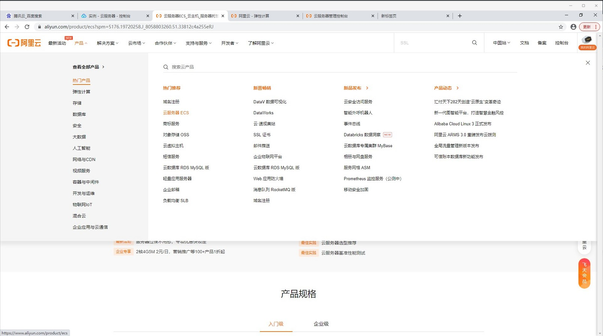
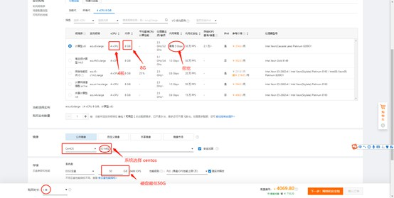
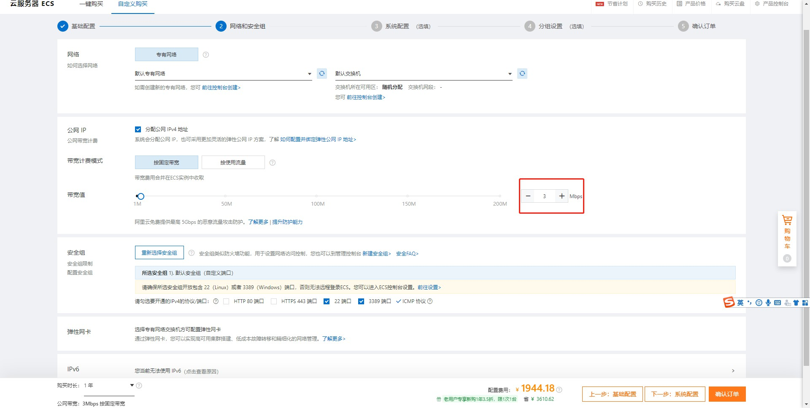
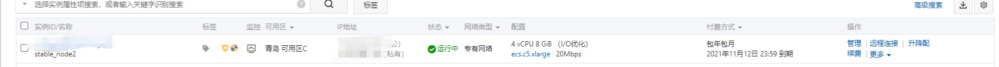

### Liunx常见问题
*  怎么购买云服务器？
以下以阿里云为例
1.注册[阿里云](https://www.aliyun.com/?utm_content=se_1003105700)账户
2.注册完成点击产品，选择“云服务器ECS"



3.进入页面点击，直接购买。进入服务器配置页面
可以按照如图配置页面购买，此配置是根据主网搭建硬件要求，页面内存可以选择4G，


 
内网带宽不做限制，外网带宽按自己需求选择



选择完成点击“确认订单”，完成支付就成功购买了一台服务器。
查看自己所购买的服务器，点击右上角的控制台，选择实例，在实例中可以看到自己购买的服务器




*  运行解压缩出来的文件提示版本错误？
此问题是网络中存在低版本的主网程序，检查自己安装的版本是否是最新版本。如果是不予理睬。
 
### 节点常见问题
* 区块高度不同步

* 区块卡在某高度不动

* 节点密码忘记


### 手机连接问题
* 交易签名失败
交易签名失败通常有如下情况：
1.交易没有发出
2.网络节点当中质押节点过少，没有设置矿费。
3.同一个账号不能连着做交易

* 搜索不到节点
搜索不到节点通常是手机wifi与节点wifi不在同一网段内。

* 解质押失败
解质押的时候要求本笔资产要在30天之后才可以解质押这笔质押资产。

### 其他问题
* 交易不成功
可能原因 ：
	1.判断节点是否连接到服务器
   能否ping通公网服务器。11187、11188、11190端口是否开放。
	2.看余额是否够即手续费+交易费是否小于余额
  运行程序  

 ```powershell 
   ./uenc_xxx_testnet -m   
 ``` 

   运行起来后会出现如下信息：

```powershell
Version: 1_xxx_t
Base58: 15md8eripkG9n4hGMNacEar7AqTfudvWBZ
Balance: 0
Mac md5: 887da3c400cd1fcaf2d5431abcbc647d
Signature Fee: 1100
Package Fee: 0
Block top: 1919
Top block hash: d955017db4475742caeb9b9d143c7d9b79126b9c4e5cee1b55f735b00f42fdbd
```  

   Balance是你的余额。你的交易费+矿费X（共识数-1）是你的本次交易总费用。看余额是否大于总费用。  
	3.是否设置矿费  
		signature是矿费，看是否设置矿费，设置矿费：  
```powershell
  ./uenc_xxx_testnet -s  0.015
```  
4.本节点的块高度和全网节点的块高度是否一致  
	Block tops是块高度,并通过[浏览器](http://www.uenc.io/chainExplorer/index.html#/)查看高度是否一致。

<font color='#5432F4' >Q&A:
手机端连接节点失败：手机端wi-fi要与连接的节点的网络在同一局域网内。
手机端交易失败：手机端在交易时矿费设置过低容易失败，共识数设置的过多容易失败。
手机端质押：手机端最小质押数为500UENC，并且30天之后才可以解质押这笔质押资产。
不能发起交易：当前节点账号是否在挂起列表当中，当前节点的高度是否与主网高度在5个高度之内。
</font>
