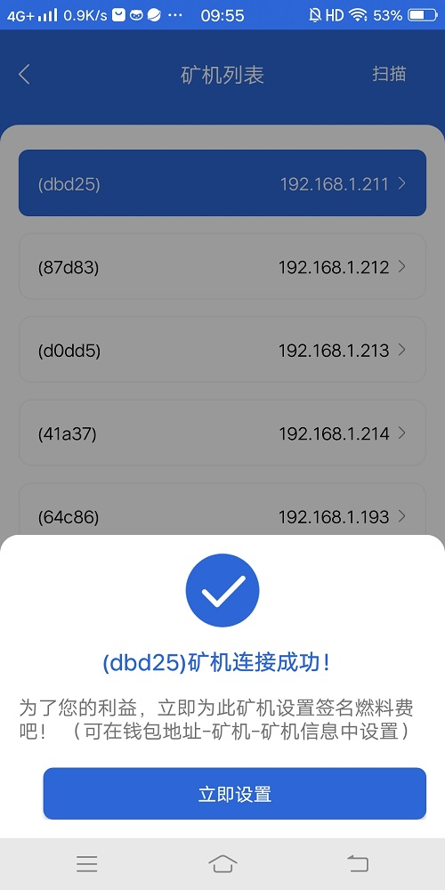

### 1.需要先下载app
   * 打开[官网](https://www.uenc.io/#/index) 最下边有带M的按钮，把鼠标放在它的右边的按钮上会弹出两个二维码，一个是Energy Club一个是Fastoken，扫二维码Fostoken安装app。 

     
   
    app安装成功后   

    
   
### 2.创建数字身份  
 * 安装成功后打开app进入欢迎页面。  
   
 * 点击欢迎页面的Agree按钮进入创建数字身份页面，在此页面手机会询问"Fastoken"需要使用存储权限是否允许，点击下面的始终允许按钮。点击右上方的中英文切换按钮下面会
 弹出三个按钮分别是简体中文，English，Cancel。
   
  
点击简体中文按钮开始创建数字身份  

   
   
    按要求输入身份名（最大长度14）和密码及重复密码点击创建按钮进入备份助记词页面。 

### 3.备份助记词  
 *  点击上一步的创建后进入提示你备份助记词的页面。

 
 * 仔细阅读页面内容后点击下一步（或者稍后备份）弹出助记词页面让你备份。

 

 
 * 备份助记词后点击下一步此时要你按刚才的助记词的顺序点击出现的助记词。

   
 
 操作完后点击完成按钮回到首页。  
### 4.连接节点  
 * 助记词备份成功后，回到首页当前显示是主账号（高亮显示）。 

   
 
  * 此时还未连接节点，点击节点切换到节点账号

    
   
   点击节点下面的 +  进入节点搜索列表  

       
  
 *   在节点列表中选择一台节点进行连接（备注：手机端必须连接wi-fi，且手机端wi-fi与连接的节点在同一局域网内）
选择一台节点，点击连接节点，弹出输入密码框，节点默认密码是12345678，输入密码。

   
 
 * 点击完成按钮如果连接成功会弹出如下页面  

   
 
 点击上面页面的立即设置会进入设置燃料费页面。
### 5.设置燃料费  
* 节点连接成功后点击立即设置进入设置燃料费界面，可以设置修改当前节点燃料费。  

  
 
* 阅读上面内容后输入燃料费点击保存，返回节点列表界面。  

### 6.主账号发起转账  
* 回到首页切换到主账号  
 
 

   点击转账按钮，进入转账页面。 

     
  

 输入转账地址交易金额拖动签名费的小圆圈设置签名费，点击共识数的-或+设置共识数。点击选择交易节点右下方的箭头进入节点设置页面。 

   
 
 点击要选择的节点返回到转账界面，点击转账按钮进入确认转账界面点击确认转账系统提示交易发起成功。
 ### 7.节点账号发起转账   
* 进入首页点击节点切换到节点账号。  

 
 
* 在节点账号点击转账按钮，进入转账页面。 

 

 输入钱包地址交易金额。在单节点签名费下面拖动小圆圈设置签名费，点击共识数右面的-或+设置签名费。节点发起转账交易节点不用选择。
 点击转账按钮弹出输入节点密码界面  

  
 
 输入密码后点击完成弹出确认转账页面  

  
 
  阅读界面上的信息后点击确认转账按钮系统提示提交成功。 

    
 
### 8.查看交易情况  
* 在首页点击进入钱包右面的小箭头进入钱包  

  
 
 钱包页面 

   
 
 在此页面中可以查看你的交易是失败还是成功或在交易中。
### 9.主账号退出   
* 如果有多个主账号，正在使用的主账号不可以退出。 
按下高亮显示的主账号按钮左滑出现设置按钮  

  

 
  点击设置按钮进入设置页面  

    

 退出前如果没有备份助记词系统提示让你备份助记词，备份后点击退出当前账号按钮会弹出密码框，输入密码后点击确认后退出主
 账号返回到注册数字身份页面。
  
### 10.恢复账号  
* 两种方式：1助记词恢复；2私钥恢复。  
 在首页点击钱包管理按钮，进入钱包管理界面点击右下角的创建按钮。  
 进入创建数字身份页面，点击最下面的恢复身份按钮进入恢复身份页面。   
 选择助记词或私钥恢复身份。   